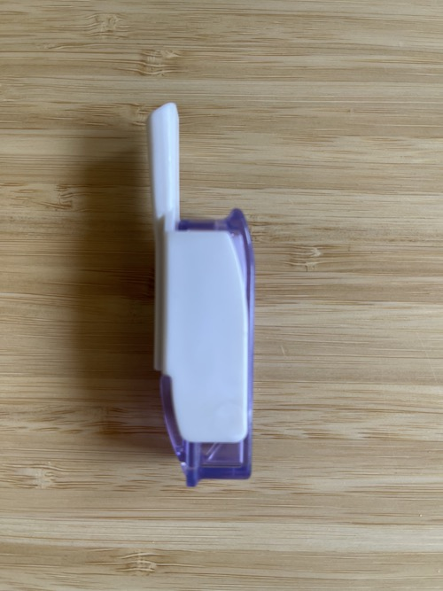
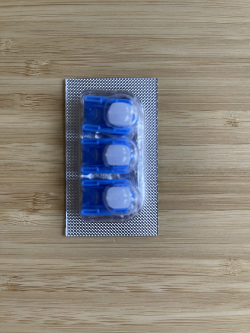
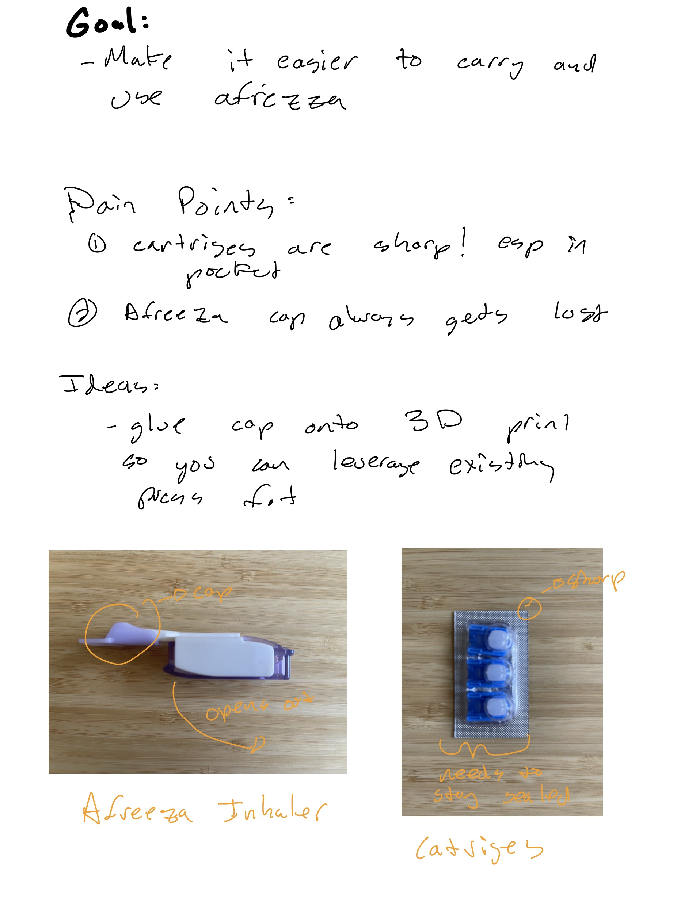
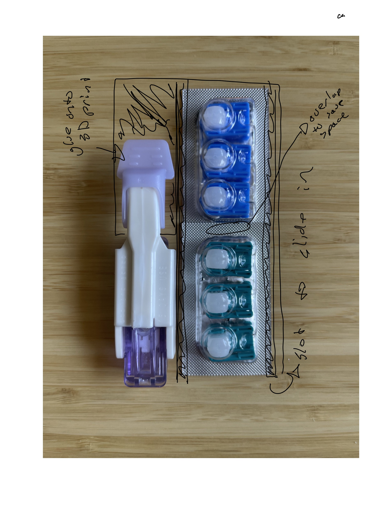
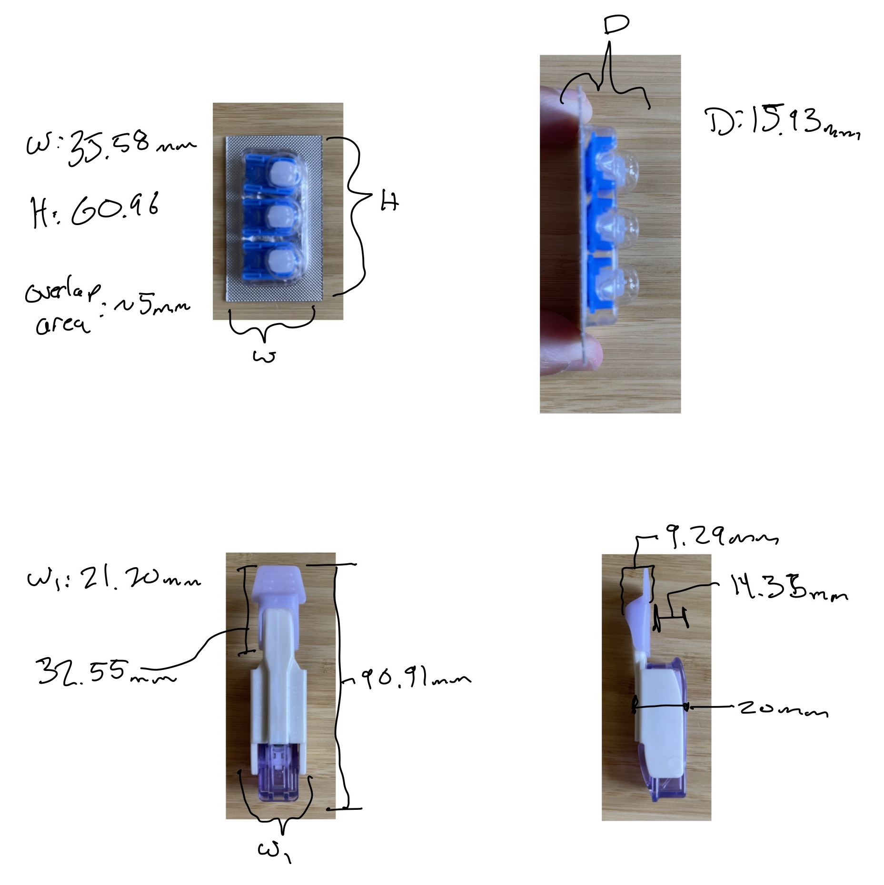
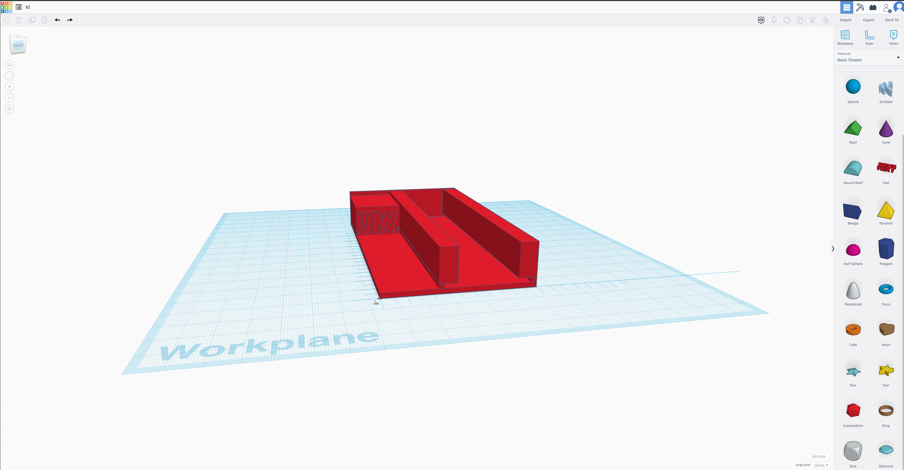
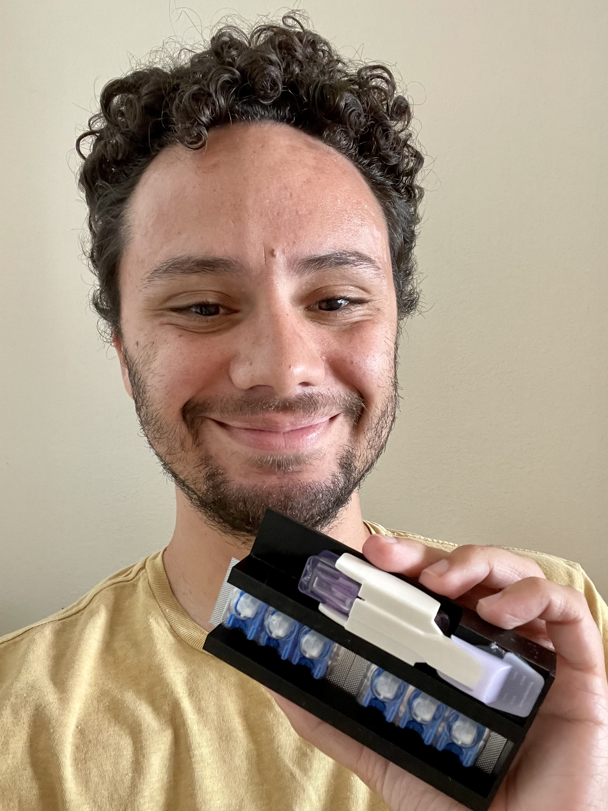

# Background
OK, you know the deal! 😎 I have Type 1 Diabetes, which means I need insulin to survive. 
This is usually administered via a syringe, or via an insulin pump. 
I have been trying a new medication though, in conjunction with my insulin pump, and it is Inhalable Insulin.
The inhaler looks like this:

And the insulin powder which you inhale is stored in these plastic cartridges:

They come in sets of 3, and each 1 gets loaded in the inhaler for use.

# Problem
Here is the problem though, carrying this stuff in your pants pocket is ridiculously annoying.
Especially the catriges, which for some reason are insanely sharp and pokey on the edges.

# How can we make this better?
3D Printing! 🏄‍

Like all good nifty problems in life, it can be solved with 3D printing (I hope). 
Quick disclaimer before we proceed as well, I've only ever 3D printed one thing in my life, and it was a simple box...

# Onto the design phase

One idea I want to call out here, is to use the existing cap as a way to press fit the inhaler into the carrier.
Why reinvent the wheel, I can just superglue that cap to what I design.

# Ok now lets make a prototype

# Now lets do some measurements

# Ok now lets do some modeling

I don't have much expierence with 3d modeling, but from what I read online, Tinkercad seemed the most approachable.
I used that to implement my design. 
BTW helpful hint, learn to use the Tinkercad ruler as early as possible, 
although as you will find out below, I still have some room to improve in that area.

Next I sent it off to a 3D printing service, and was left with the hardest part, waiting for the printed part to arrive.
Wow this was brutal and made me strongly suggest just getting a 3d printer!

# Let's See The Print! 🕺

# That's awesome! Can I download the STL File?

You sure can, I have uploaded the stl file to my github.
You can check it out here.

[https://github.com/dddiaz/models/blob/main/afreeza-holder-v2.stl](https://github.com/dddiaz/models/blob/main/afreeza-holder-v2.stl)

# What's Next?

Ok this was a great first pass! It looks like I didn't nail the width on the cartridges though, 
so I actually had to trim them with scissors to get them to fit.

So first order of business would be getting that spacing right. I also wish the walls werent as tall, 
so I might work on that for the next version too.

Also rounded corners would be nice. And if I was feeling super fancy, maybe print in metal?

Anyways, thanks for reading, see you next time!

