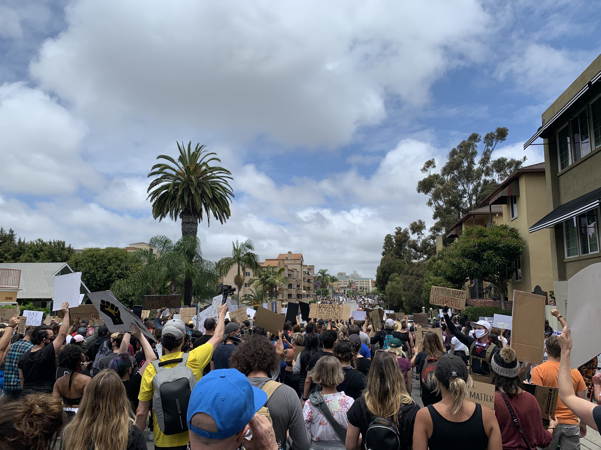

At a time when every person has every excuse not to get out there, people came out in massive numbers.
People weighed the risk of a global pandemic, against the cost of doing nothing, and they chose to do something.
This is democracy in action, this is an America at its best, this is people realizing their power.

With major global events straining our ability to persist, 2020 has been exhausting. 
We have been isolated in ways we are not used to, to save people we may not know. 
Then something pierced our bubble of existential dread.

The death of *George Floyd*

A person many of us did not know.
What we did know was that he was so senselessly killed, it demanded we drop our preoccupations to address the issues that have been killing Americans a lot longer than Covid-19: Systemic Inequality, Racial Injustice, and Racism in America.

And so we protest.  

Full well knowing the risks. Weighing the risks against the cost of doing nothing, the cost of staying silent, the cost of the status quo.

This is the first political protest I have ever participated in. It was a march from downtown San Diego to Hillcrest. 
It was completely peaceful, but even more so, it was powerful. 
The picture above is a photo of where we stopped to listen to members of the community speak in Hillcrest.

To see people from all walks of life, gathered in unity, all expressing: __BLACK LIVES MATTER__.

This moment was powerful because it gave me hope.
Hope in a country that is finally declaring enough is enough. 
Hope in a community that is recognizing systemic inequality. 
Hope in a people that are standing up for what's right.

This country was founded on protest. A protest for a certain set of ideals and rights.
Those rights have not been administered equally, and our ideals have not been exercised universally.
It's now up to us to make those rights and ideals a reality for every person.

Above I described the power of this moment, but the truth is, this is not a moment, __it's a movement__, 
and I unequivocally stand with the Black community in this movement.  

I urge you to get involved with your community, and see how you can help.

Don't forget, you can also protest with you wallet. 
I encourage you to donate to organizations that are helping to further this movement.

- [NAACP](https://www.naacpldf.org/)
- [ACLU](https://www.aclu.org/)
- [Public Allies](https://publicallies.org/)

And lastly, I urge you to vote.

- [California Voter Registration Website](https://registertovote.ca.gov/)

Note: as of this writing, current protests have resulted in:
- The officers involved in George Floyd's Death have been arrested and charged.
- LA Police Commission has announced up 100-150 million in cuts to the police department budget to be reinvested in communities of color.
- San Diego PD has banned the use of the Cardiod Restraint. 
- Several Confederate Statues have been removed.  

