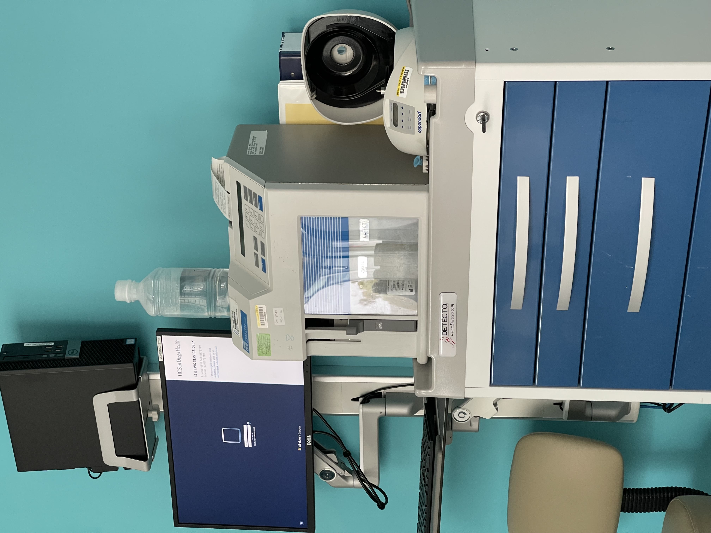
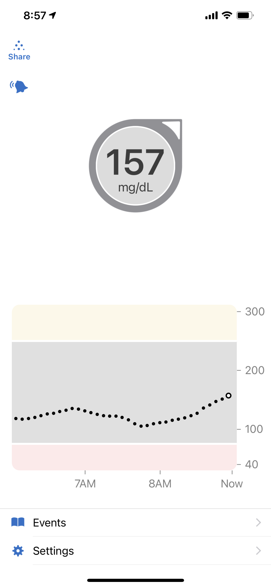
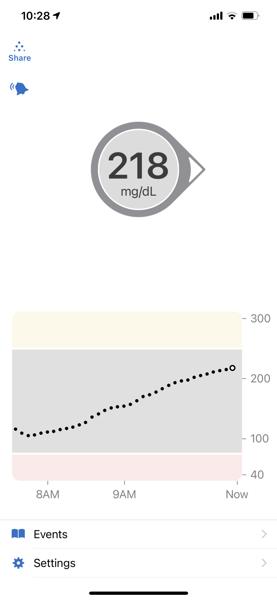
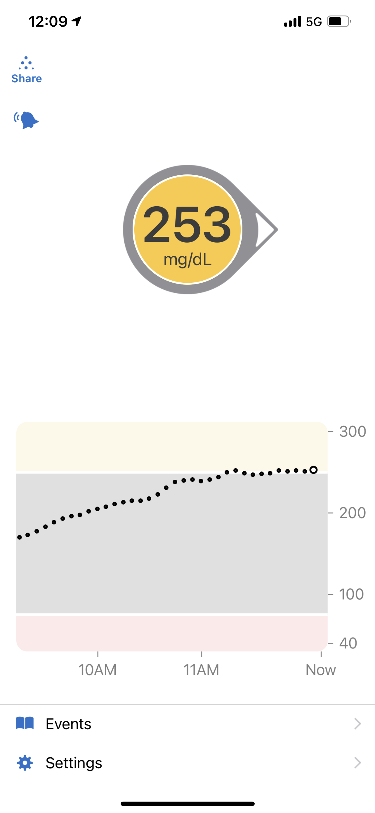
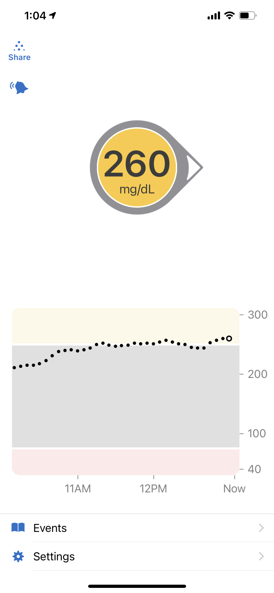
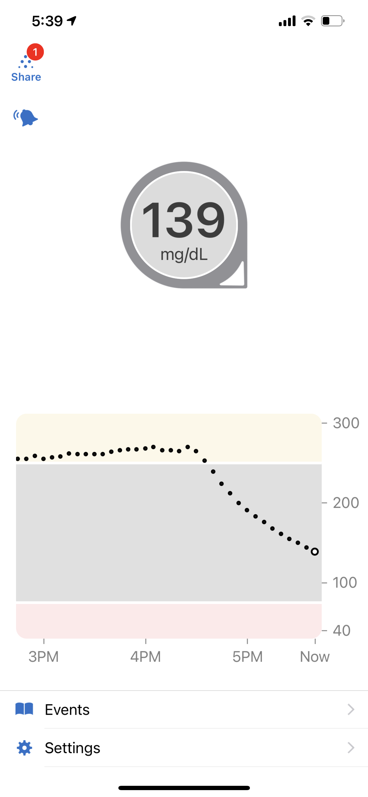

# Did someone say cheese 🧀?

Recently, I had an incredible opportunity to be part of a Clinical Trial for a New Type 1 Diabetes Drug. The drug works in a couple different ways, 
but to save you on some of the more intense Biology I will say that it "may" help me manage my 
Type 1 Diabetes better! I wanted to use this blog post to talk about the experience, more specifically a special part 
of the trial where they do an insulin withdrawal study.

## Diabetes Background

Wait insulin withdrawal, diabetes? What are you talking about?  

In case you are not familiar, I have __Type 1 Diabetes__ which is an auto-immune disease that causes my body to attack 
the insulin producing cells in my pancreas. Insulin is what helps your body use the energy (glucose) in the food you 
eat. To manage this disease I use some extremely cool pieces of technology. One is a continuous glucose monitor called 
a __Dexcom__ CGM. I wear this CGM on my body, and it measures the amount of glucose in my interstitial fluid (also known as the
fluid between cells) every 5 minutes. I also use something called an insulin pump. Diabetes management is basically 
a complicated dance to try to replicate the behavior of normal functioning islet cells, and how they release insulin
to manage the amount of glucose in your blood. It's not always an easy battle, 
that's why new technology and therapeutics help a bunch. It is also one reason why I was so excited to participate in this
study.

## Study Background

So as part of the study, I am randomly assigned to either the trial drug, or a placebo. (Also I specifically asked if the
placebo was a sugar pill, cause that would give away the fact if it's the study drug or not pretty easily. I confirmed it's
not!). I take that pill once a day for a full week then at the end of the week, I participate in an insulin withdrawal 
study. Note: this pill does not cure Type 1 Diabetes in any way, and is supposed to be used in conjunction with normal insulin. 
(There is no cure for Type 1!)  

In the insulin withdrawal study, they hook me up to an IV, a nurse closely monitors me, and they disconnect me from my 
insulin pump (which is something I need to survive!)

Then they measure my glucose, ketones, and several other factors every 30 minutes to an hour.

So how did I fare? 🏄‍

# The Insulin Withdrawal Study 💉

I was actually super excited to do this part because this was something I had never done myself. I was looking forward 
to learning more about how my own body works.
To make sure I didn't miss any details I made sure to document my symptoms and some of my readings throughout the day of my study.  
Another interesting fact, another t1d did the study with me on the same day, and she was in the bed next to me.
It was even more fascinating to compare what was happening to me and what was happening to her. 

## What do we expect to happen

If I was on the study drug and not the placebo, we would expect my body to produce less ketones (something that can make me sick) and absorb some excess glucose.
If I was not on the study drug I would not expect the above to happen.

# So what happened?

(This is a summary of the events I documented in my journal.)

## 6:40 AM

I walk into the room where I would be staying. To be honest I was a little taken aback because it had like a legit 
hospital bed and everything. Not sure why I expected it to be more casual, but I definitely got a little nervous. It's kind of 
like when you see a white coat, and your blood pressure instantly goes up; I saw a hospital bed and was like, oh shoot, 
who is hurt? haha.

__For the record a normal blood glucose reading is between 80-120. A normal ketone reading is between 0.2 and 0.8 .__

I started the study at a blood glucose of 129 after fasting the entire night 
(note this is so close to normal because of some very cool algorithms on my insulin pump that automatically adjust my insulin throughout the night), which is slightly above average, but still okay.
My ketone reading was 0.3, so well within normal range.

## 7 AM

IV Inserted! About to disconnect my pump! Excited and nervous.
Nurse is a pro and did a perfect job with the IV, apparently she said she has been working in the ER for over 15 years!  
__Ketones started at 0.3__  
Got some details from the staff on how exactly this drug works and what pathways it's using. 
Almost feels like you have to have a bio degree just to be Diabetic sometimes 😂. 

__Insulin Pump Disconnected!__

I still have some insulin on board at this time, but it should begin to rapidly exit my system. Within a couple of hours 
I should have no insulin in my body.

## 8AM

One of the periodic tests they do is measure my glucose with a machine called a KSI machine. Even though I have a dexcom and a glucose meter,
this thing is known as the gold standard for glucose measurements. Apparently though it costs 15K! Wild! Also, funny enough,
my dexcom was often within at least 20 points of it.

## 9AM

Disconnected for about 2 hrs now. Still feeling pretty great. __Blood sugar starting to creep up to 151. Ketones starting to creep up as well to 0.6.__  

I have included a picture of my continuous glucose monitor at the time.
The insulin pump disconnected around 7am, so you can see the onboard insulin get used up, and by 8am, my blood sugar is starting to creep up due to lack of insulin.

## 10:30 AM

__Ketones up to 0.8, blood glucose up to 208.__ If I am on the study drug my ketones should level off a bit before creeping up again.

Also have a chance to meet my neighbor in the bed next to mine, who is also doing this same study and is 1 year younger than me!

I have included a picture of my continuous glucose monitor at the time.
By this time, any remaining insulin I had in my system from the morning should be gone.

## 11:13 AM
__Ketones up to 1, blood glucose up to 238__

## 12:20 PM
__Ketones holding at 1.0, blood glucose flattening out.__ Strong indication that I am on the trial drug. 
My t1d neighbor who we think is on a placebo has their ketones continuing to climb.
Still feeling good myself.

I have included a picture of my continuous glucose monitor at the time.

## 1:19 PM 
__Ketones holding steady at 1.1, blood glucose at 243__
T1d neighbor's ketones are still escalating although their bg seems to have stabalized like mine.

I have included a picture of my continuous glucose monitor at the time.

## 1:45 PM

__Ketones 1.1, BG 242__

## 2:17 PM

__Ketones 1.2, BG 247__

Still feeling good. 

## 3:00 PM
T1d neighbor is about ready to barf, her ketones are still going up. I am still doing okay.

## 3:17 PM
__Ketones jumped to 1.6, bg is at 241__
Starting to experience symptoms of the ketones. My stomach doesn't feel sick yet, but it's warm as hell (if that makes any sense).

## 4:10 PM

__I am calling it.__  
I am not specifically feeling sick, but my stomach is definitely hinting at what's about to happen. Considering how it hit my neighbor so fast and intensely, I am trying to be cautious.

__Ketones jumped up to 1.9__

## 4:29 PM
Symptoms hitting me like MAC Truck. Feeling like I am about to barf, and my entire body feels warm.

## 4:47 PM
Got some insulin in my IV. Interesting factoid, all insulin used in hospitals in just R (aka Regular). 
This isnt something thats used often in normal day to day diabetes life because its such an old formula. 
We tend to use new insulin that have extra additives that make it act faster, 
but because it is injected directly into the blood, it is as fast as its going to get.

Also, they doordashed me some chipotle which was awesome! So I got a non-hospital meal to look forward to when I am feeling better.
Especially since I haven't eaten all day as part of the study!

## 5:29 PM
__Ketones going down to 0.6 and BG down to 155__
Burrito was also delicious.

Also one more interesting factoid, they tested one of the covid vaccines in this same place!

I have included a picture of my continuous glucose monitor at the time. You can see the insulin doing its work here.

## 6:30 PM
ALL Done! I am home and feeling great. Even had a chance get an outdoor walk in! Have to make sure I close my move goal on my apple watch! Haven't missed a day in over 146 days!

# SCIENCE RULES! 

## Couple learnings.
- My BG didn't shoot up as fast as I thought it would. The same occurred for my peer. What really did us in though was the ketones. 
  When we started to hit 2, it was all downhill from there. 
  And for the record, this wouldn't be sustainable much longer because we hadn't eaten all day, and our glucose would eventually continue to creep up.
- I already knew this, but quadruple confirmed Diabetes is a complex disease with a very complex series of pathways that are all vital.
- I think I was on the actual study drug and not the placebo, but I will not know for sure until the end of the trial, which will not be for a while.
- It is super nifty to view my dexcom blood glucose trends throughout the study! That's why continuous glucose monitors are so critical to normal diabetes management.

## Conclusion

I had a terrific experience in this clinical trial. It was the first time I have every participated in something like 
this, and I would totally do it again. 
I want to specifically call out how incredibly nice and accommodating the doctors, nurses, staff, and coordinators were! 
I hope they can take the learnings they get from this trial to help people!
In the end, I think it was a day well spent in the pursuit of __SCIENCE__, and I am glad I got to be a part of it.

