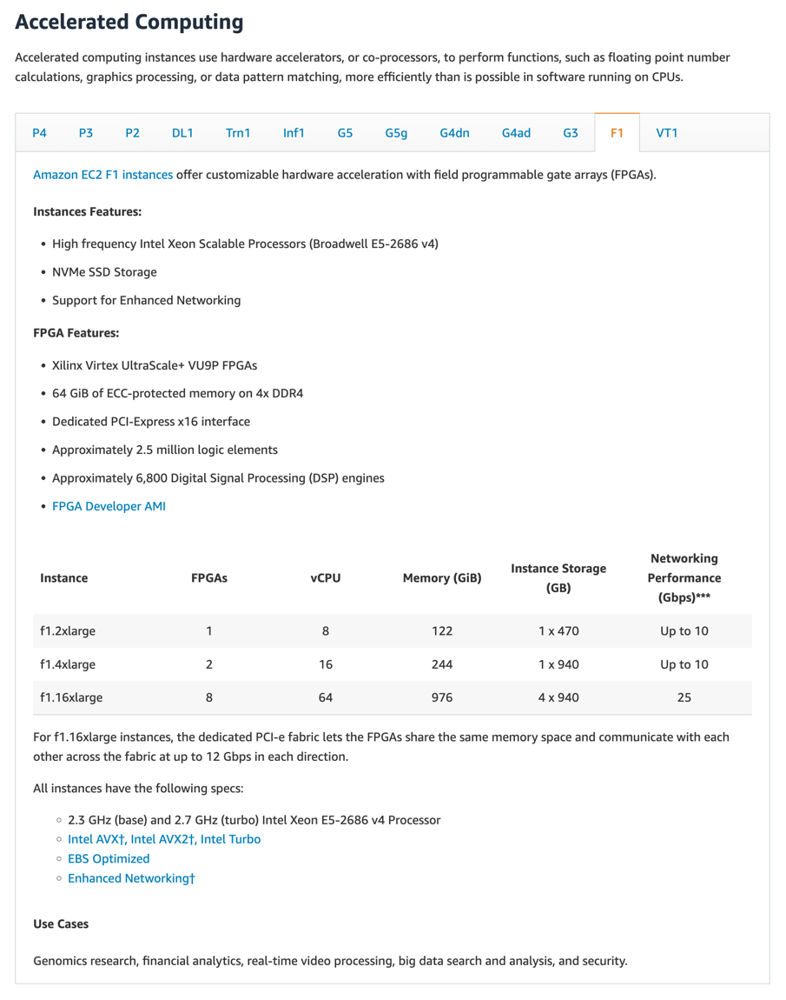
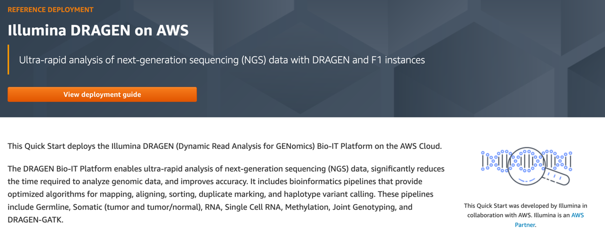

# Before I Start 🛸
> Imagine a flashy spaceship lands in your backyard. 
> The door opens, and you are invited to investigate everything to see what you can learn. 
> The technology is clearly millions of years beyond what we can make.
> This is biology.
> -- [*@bert_hu_bert*](https://twitter.com/bert_hu_bert)

This is one of my favorite quotes about biology, and it ties in surprisingly well with the Dr. Who Theme. 
Genomics really is like looking 1 million years into the future. In the pursuit of understanding this advanced system, 
we generate huge amounts of data, leverage some of the most cutting edge hardware you can imagine, 
and utilize cloud hyper scaling at a level I haven't seen in any other industry.
If that didn't sound cool enough as it is, that's all in pursuit of improving human health.

# Truly "Big-Data" 💽
Each time a persons’ 🧬 genome gets sequenced, over 200gb of data is generated! 
Everything from the raw data from the sequencer, 
to the actual letters of the genome (A,G,C,Ts), 
to the actual ways in which the genome varies from the reference. a lot of data is generated.

But as most engineers know, raw data is cool, but deriving insights from that data is even cooler.

# High Performance Computing 💻
In order to translate the above data into actionable insights (commonly known as the VCF file or Variant Call Format File), 
we need some fancy high performance computing.
We use something in AWS called an F1 Instance.

Check out this table from the aws docs:

F1 instances have a special piece of hardware called an FPGA, or field programmable gate array. This piece of hardware
can be programmed to do specific tasks very, very well.
Imagine a graphics card, but for genomics, that's what an FPGA enables. 
It can run genomics code at a hardware level, to ensure we can convert our sequence data into insights in a 
reasonable amount of time.

This hardware/software combo is called Dragen, and a quick disclaimer, I help work on it at Illumina.

If you are curious on spinning up your own f1 instance, AWS has a very cool guide on how to do just that!
[Link](https://aws.amazon.com/quickstart/architecture/illumina-dragen/)

But what king of insights is this infrastructure enabling. 
Well everything from identifying cancer early, 
diagnosing rare diseases in children, 
to analyzing how covid is mutating.

# Cloud Hyper Scaling ☁️
Sequencing one person is cool, but what about a million.
There are recent efforts by the National Institute of Health to sequence a more diverse cohort of people at the same time, 
and see if by overlapping the sequence data of this cohort, we can derive insights into common overlapping mutations and how they contribute to, or prevent disease.
Insights that were previously hidden to us at smaller scales when we only looked at a single sequence in isolate.

In California, we have something called the All of Us program in pursuit of this idea.


To accomplish this goal, we have to use a huge amount of compute.
Imagine spinning up thousands of nodes to do genomic analysis at scale, and then easily scaling down to zero.
This is a real problem that is solved with the help of a scalable cloud, and is particularly useful when the infrastructure costs are non-trivial.

And to give context on what non-trivial infrastructure costs means, a single aws f1 instance can range from 1-15 dollars an Hour. 
Not an instance type you want to leave running when you aren't using it!

# In pursuit of improving human health 🩻
So why do all this?
Why manage huge amounts of data, with massive amounts of compute.  

Simple, to improve human health.

A recent example of this from Rady's Children's Institute will help motivate this point: [Link](https://radygenomics.org/case-studies/fitzs-story/)
> Less than a week after Fitz was born, a newborn screening test revealed a rare genetic condition called Severe 
> Combined Immunodeficiency (SCID), commonly known as “bubble boy disease.” 
> Rapid whole genome sequencing pinpointed the exact type of SCID and helped guide life-saving treatment decisions.

# My Connection 💉
I also have a personal connection to Genomics. As someone with Type 1 Diabetes, 
there is active research underway to understand the genetic component of Type 1 Diabetes (which is an auto-immune disease).
It is extremely complex, but I am hoping one day the strides we make in genomics can have a positive impact on Diabetes.

I recently tweeted about an interesting article analyzing the connection between HLA variants and Auto-Immune diseases below.



# Why write this article? 👨‍💻
I am extremely fortunate to have the unique opportunity to exercise my software engineering skill set while making 
a real impact on human health.
But I feel that many very talented software engineers have no idea this field even exists.
I hope that by writing this article, I can convince some of you to consider working in Genomics to help people, much like the Doctor.

P.S. Illumina is [hiring](https://illumina.wd1.myworkdayjobs.com/illumina-careers?jobFamilyGroup=662dc3b84e394f76a0fa663a3b349ff1) 🥳

