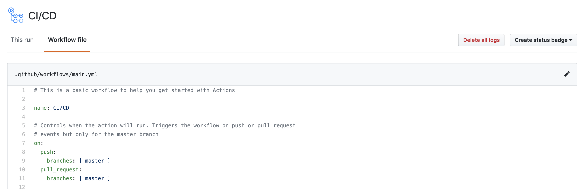
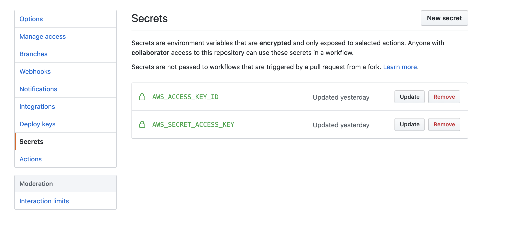
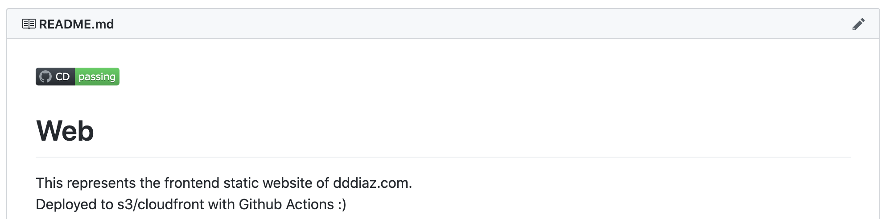

# Background
dddiaz.com is a static website built with Hugo. [Hugo](https://gohugo.io/) is a super nifty framework 
that lets you easily create content in markdown, that can then be converted to html on build.
Previously I used AWS Codestar to manage the various aws code* (codebuild, codedeploy, codecommit) resources to build 
and deploy my static front end and simple lambda backend. These resources handled the hugo build, hugo deployment to s3,
and associated cloudfront cache clear. Cloudfront helps me globally distributes my website, 
which should slightly cut down on load times, but its cache needs to be reset on deployment. 
CodeStar also handled the backed lambda deployment process. While 
I enjoyed Codestar, and it had rock solid uptime, it was rather cumbersome. It was quite awkward to have to navigate
into the AWS console to check the status of my current deployment.


# Github Actions to the Rescue
Recently I noticed [Github Actions](https://github.com/features/actions), 
and wanted to see if that could help reduce some of the complexity around my build 
and deployment process, while giving me a chance to play with something new. Oh, and not to mention, it's free!

So in the following lines, I am going to describe what I needed to do, and my overall conclusion.


# Building the Action
Everything relating to github actions can actually be created in the github gui. In fact they have a super fancy editor
for creating the action with intellisense.



They start you off with a template, which is easy to use as a jumping off point. From there, I knew the first hurdle
would be my aws creds, as they are needed as part of my deployment. 

Well wouldn't you know it, AWS already posted a 
library for me to use, that makes this process seamless.

```text
- name: Configure AWS credentials
  uses: aws-actions/configure-aws-credentials@v1
  with:
    aws-access-key-id: ${{ secrets.AWS_ACCESS_KEY_ID }}
    aws-secret-access-key: ${{ secrets.AWS_SECRET_ACCESS_KEY }}
    aws-region: us-east-1
```

Now you might be wondering about the aws secrets, github has that handled too. There is a secrets portion of your repo
where you can upload all your relevant secrets.



Now that aws has set up my creds and set up the aws cli, I need to build my actuall hugo website. Turns out there
is an action I can import here too.

```text
- name: Hugo Setup
  uses: peaceiris/actions-hugo@v2.4.11
  with:
    # The Hugo version to download (if necessary) and use. Example: 0.58.2
    hugo-version: 0.70.0
    # Download (if necessary) and use Hugo extended version. Example: true
    extended: true

- name: Hugo Build
  run: hugo --minify
```

Last step is to upload to s3 and reset the cloudfront cache.

```text
- name: Copy frontend files to S3 with the AWS CLI
  run: |
    aws s3 sync public <s3-bucket> --delete
    
- name: Clear Cloudfront Cache
  run: |
    aws cloudfront create-invalidation --distribution-id <your-distribution-id> --paths '/*'
```

And that's it! Before you know it, you are doing one click deployments!  

You can even create a badge to display on your main readme.  
 


Whoa whoa whoa, this seem pretty easy, but what about that backend api you mentioned earlier.
Ahh, glad you mentioned that. 

## Backend Action

Some background first, I have a backend api availble at 
[https://api.dddiaz.com/birthday](https://api.dddiaz.com/birthday) which contains super critical information on if it
 is my birthday ;)

It's a simple python lambda that I can deploy with cloud formation. So, similar to above, I will create an action,
then I will set up my aws creds, then instead of hugo build I will run the following aws commands.

```text
# Runs a single command using the runners shell
- name: AWS CF Package
  run: aws cloudformation package --template-file template.yaml --s3-bucket <your-bucket> --output-template-file packaged-template.json

# Runs a set of commands using the runners shell
- name: AWS CF Deploy
  run: |
    aws cloudformation deploy --template-file packaged-template.json --stack-name <your-stack-name>
```

And that's it!

Here are the links to the full workflows if you would like to take a peak: 
- [lambda workflow](https://github.com/dddiaz/api.dddiaz.com/blob/master/.github/workflows/main.yml)
- [hugo workflow](https://github.com/dddiaz/dddiaz.com/blob/master/.github/workflows/main.yml)

# Conclusions
Pros:
- Free!
- Super Easy to work with and setup
- You can import other people's libraries
- Surprisingly fast build

Cons:
- Vendor Lock In


I really liked Github Actions, and I am glad I decided to move to it. While the build syntax is very specific to github,
I had that before with AWS CodeBuild. The advantage I have now though,
 is that its easy to see the status of my buid and deployment, 
and it doesnt cost me anything to run!
