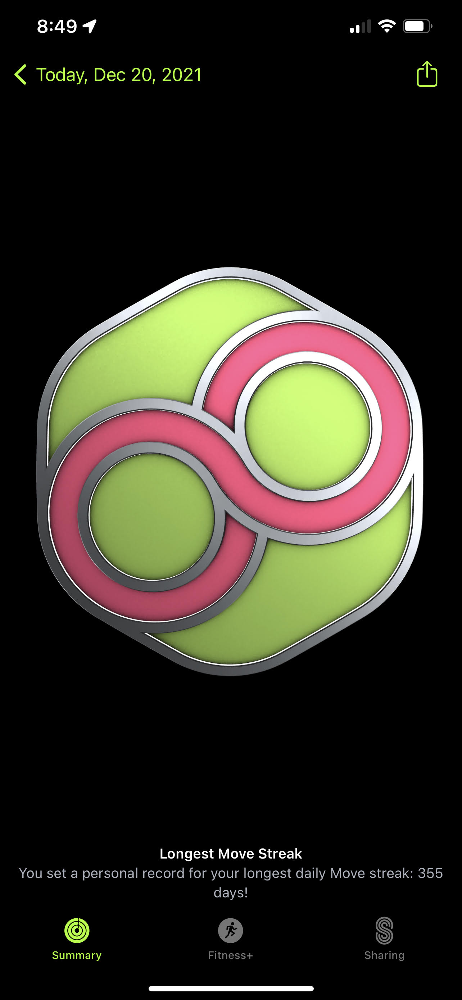
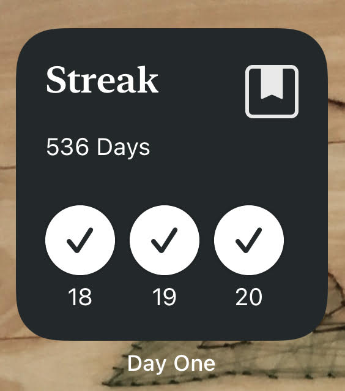

Oh Gosh, is it that time of the year already! Time to look back on 2021 and see how I did with my goals 🚀
I had a check in at the end of Q1 with myself, you can check out that post [here](https://dddiaz.com/post/goals-2021-q1-checkin/).
As a quick reminder, the point is not necessarily to check off every goal on the whiteboard, but point me in the direction I want to go and grow in.
Obviously this is more of a personal post, so if you prefer my more technical content, feel free to skip. 😀

## Goal Board 🥅
As a quick reminder, this is what I posted at the beginning of the year.
```text
1. Love
2. Health
    - Get the vaccine
    - Close Exercise ring everyday
    - Journal Everyday
    - Greater than [REDACTED PERCENTAGE] time in range for 2 weeks 
3. Social
    - Become a better listener
    - Find a mentor
    - Reconnect with old/new friends (+ t1d friends)
    - Illumina Softball / Cycling
4. Learning:
    - 12 blog posts this year
    - Do conference / tech talk
    - ML Project
5. Adventure Ocean
    - Do a bunch of ocean activities including but not limited to: surfing, sailing, snorkeling, kayaking, kitesurfing

```

### Love ♥️

My significant other is a huge part of my life, and I am happy with how we continue to grow together. 
Although I think she may be starting to steal my jokes, or am I stealing hers?! 🤔 😂

### Health 💉
Happy to say I am both Vaccinated and Boosted.
I am in awe of what humanity can accomplish when it sets its mind on something.
As someone who is at an increased risk of complications from covid, every person that gets the shot isn't just helping themselves, they are also helping me.
For that, I say thank you. 🙌

I am also happy to report I am on day 355 of closing my apple activity rings!!!

Hoping to close out the year with 365!

I also have been doing a great job journaling every day. 
I use the Day One App, and it prompts me every day to journal, as well as shows me what my current streak is.
I tend to write about what happened that day, how I felt, and what I am thankful for. ⌨️
It has been very nice, and I highly recommend it. It is especially interesting looking back at 
some posts during the peak of the pandemic. 



My last major health goal has been to increase my glucose time in range.
More specifically to have a "Top Secret" percent time in range over the course of 1 week.
This has obviously been the one that has required the most effort.
Luckily with the help of technology I can generate historical reports on my glucose data,
and I can say that on the week
of 4/12 - 4/19 I crossed my time in range goal for the first time in 2021. 
I went on to achieve it several more times in the second half of the year too!
I think that's worth celebrating :)
The hope is to have more weeks like that in the new year.

### Social 🕺
The first item in this bucket was becoming a better listener. It is something that has definitely been on my mind and 
something that I am still actively working towards.

I also mentioned that I wanted to find a mentor. 
I initially thought I had failed this goal, but then I took a second to think about people I had gone to for career 
advice, who wanted to see me succeed, and was able to think of several people. 
While in the moment I may not have labeled them as mentors, in hindsight that's exactly what they were, and I am grateful to them.
I also made sure to reconnect with some of my previous mentors, which is the perfect segway to the last bucket; 
connecting with friends old and new.

After 2020, like many people, friends and family became a more top of mind priority.
For me in particular, I wanted to put a lot of energy in reconnecting with old friends, and making new friends along the way.

I went on a hike with one of my best friends from high school in the Smokey Mountains.
I played in the illumina softball league and met a bunch of new people at work!
I hung out with a bunch of T1D Friends!
Went to my friends wedding. 
Reconnected with some old friends from one of my old jobs.
Had dinner with some of my old mentors.

And spent many days with my new niece!

### Learning 📚

I wanted to write 12 blog posts in the year 2021, and I got pretty close!
This will be my 10th blog post of the year.
All I can say is writing is a lot more work than you would think, but still a very rewarding experience.

I also wanted to do a tech talk or conference.
On my new team I actually did a couple mini tech talks, which makes me happy.
I love talking about technology and nifty tools. Hoping I can continue to evangelize cool tech in the new year.

I also wanted to do a ML Project.
I met that goal in Feb when I created a machine learning algorithm that could predict which days I exercised
based on that days blood glucose reading with 79% accuracy.
You can check out the post [here](https://dddiaz.com/post/glucose-datascience/).

Lastly, I have taken on a new role which has required me to learn a bunch about bioinformatics.
I have been fortunate to be surrounded by many people who are willing to teach and I have been 
fascinated by how incredible biology and genomics is.

### Adventure Ocean ⛵️
And finally we have Adventure Ocean.
Snorkeling in La Jolla Cove continues to be a huge highlight. 
I also bought a surfboard attachment for my e-bike which I have used several times.
Lastly, I hiked up the coast from Scripps pier to Solana beach (around 10 miles) which was a blast.

## Conclusion
Looking back at this year, I have become even more cognizant that the relationships I have are 
what continue to bring me joy.
I am also extremely thankful for my health. 
I am excited for what I hope to be a great 2022. 

---
"Too much sanity may be madness ‒ and maddest of all: to see life as it is, and not as it should be!" - Miguel de Cervantes
