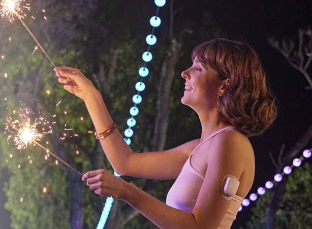
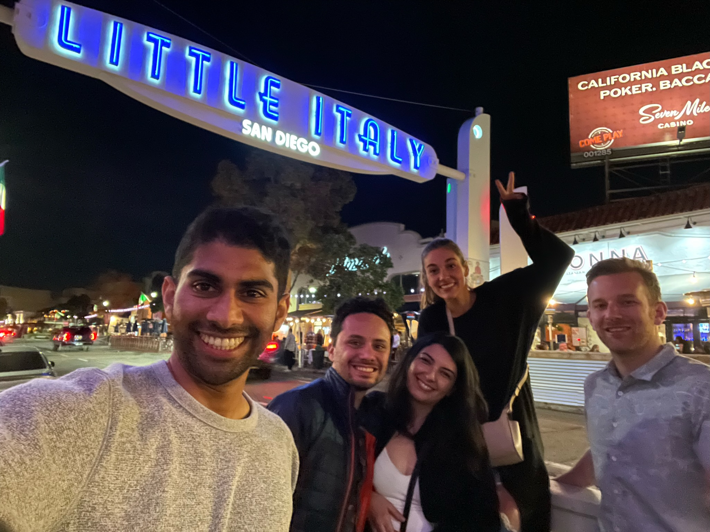
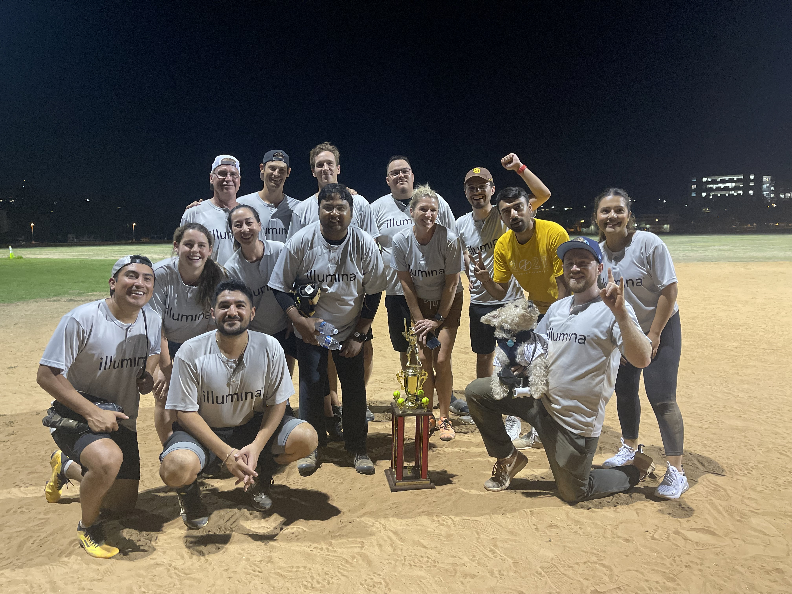
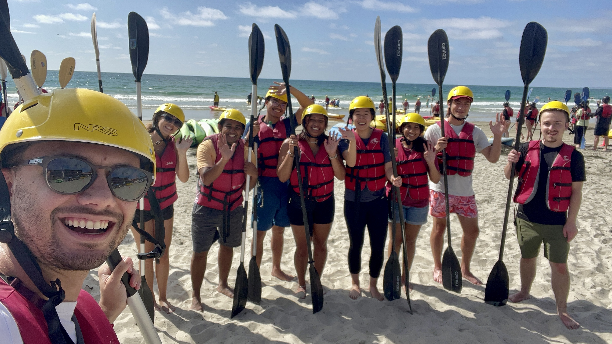

Wow! 2022 has come and gone! The years seem to be flying by faster and faster! Wanted to take a look back at 2022
and talk about some of my goals and the cool stuff that resonated with me.

## Goal Board 🥅
As a quick reminder, at the beginning of the year, I like to create a list of goals for myself 
(You can see last year's review here: https://dddiaz.com/post/goals-2021-review/). 
At a high level, it looks something like this:
```text
1. Love
2. Health
    - Increase VO2 Max
    - Journal Everyday
    - Greater than REDACTED % time in range 
3. Social
    - Better Listener
    - Connect with Old and New Friends
    - Illumina Softball
4. Learning
    - 2 Youtube Videos on Genomics
    - Analyze Your Own Genome
    - Learn to Draw
5. Adventure Ocean / SD
    - Efoil / surf / sail. Generally just enjoy the nice weather in San Diego and time outside.
```

### Love ♥️

Sosse is a huge part of my life, and I am happy with how we continue to grow.
We have done a bit of traveling this past year together, with the highlight being Barcelona 🇪🇸


### Health 💉
I love to walk at least once a day. There is a great park by the apartment that I like to do a loop on. It's a great excuse
to be outside for a second, and breath some fresh air. I absolutely love it. 

I use my Apple Watch to track my walks, and this past year I walked an incredible __466.87 miles__ (that I tracked). 
That is about 1.27 miles a day.

I was hoping this would increase my own VO2 Max, but it seems like it actually went down according to my Apple Watch.
I will probably need to do more research on the best way to improve this metric, and if there is a way to do it with my
daily walks.

On a different note, I have been keeping up with my journaling, and I currently have a journal streak of 908 days!

Lastly, I had a goal to increase my glucose time in range. This is a measure of how well I am staying in the right blood 
glucose range which helps me understand how well I am doing with my Type 1 Diabetes.
This year I decided to add some new tools to my tool kit. In particular, I decided to switch the insulin pump I use
to a patch pump called Omnipod.

The omnipod is an insilin pump that goes right on the skin. I have to change it every 3 days, but if you see me wearing
it, it may look something like this:

This isn't a picture of me wearing it 😂, it is from the omnipod website (https://www.omnipod.com/what-is-omnipod/omnipod-5) .
It is usually hidden underneath my clothes, but it is good context for what it
might look like if you see it poking out of my shirt.

I absolutely love it. It wirelessly connects to my continuous glucose monitor, and can automatically adjust how much
insulin I am getting based on my current blood sugar. The fact that it is a patch pump also means I can put it in a lot 
more places on my body, which makes my life a lot easier. 

It's not perfect by any means, but it's a huge leg up on my old insulin pump, and definitely light years ahead of manual injections.
I also still need to manually intervene whenever I eat, and tell it to give me a bolus of insulin, but other
that it is a lot more hands-off, which leads to a huge reduction in the mental burden that type 1 management can be.

I am most looking forward to when they release an iOS app, so I can control the pump from my iPhone!

This new technology has definitely made my life a little easier, and improved my time in range, but I still think 
there is more work to do.


### Social 🕺
Last Year I also wrote that I wanted to be a better listener. I think I have made some progress on it, but I still think
there are always ways to improve.

I also had a goal to connect with old and new friends. I think I definately did that this year, and I am looking forward to
doing it even more so next year! Isolation during the pandemic was hard for me, so I am doing what I can to cherish moments
outside and with friends.

Some highlights with friends this past year include
- Celebrating my birthday with a birthday hike at Torrey Pines
- Sailing everyday in Club Med (Mexico)
- Hoag Summer Nights with T1D friends
- Barcelona with Sosse
- Taking some Illumina Interns Kayaking in La Jolla to see the see caves and leopard sharks
- Visiting James & Janice (College sailing buddies) in their new home in Nor-Cal. 
- Second place in Illumina Softball! Woot Woot!
- Taking my best friend from high-school Antony with his Girlfriend Kathleen on a tour of the best of what San Diego has to offer.
- Padres Game with Aida, Dennys, Katharine, Sosse, and Wade.
- Vegas

Some Pictures:




### Learning 📚
For my learning goals, I wanted to create 2 YouTube videos, analyze my own genome, and learn to draw.

I did not create any youtube videos this year. I wanted to create 2 videos around genomics. I figure the best
way to prove my mastery of a certain topic is to try teaching it. I think this still may be worth pursing next
year, but there are also many people doing a great job of this on Youtube already. I was particularly impressed
by https://www.youtube.com/@OMGenomics

As for analyzing my own genome, I can happily say I did this, looking for my own Type 1 Diabetes variants with 
my own VCF File in hand. It was so cool, and I wrote about it here: https://dddiaz.com/post/my-t1d-variants/

I also took an intro to drawing class this past year as part of UCSD Extension. I was surprised by how many times 
I felt super incapable of the assignment, then came out the other side with something that I wasn't completely embarrassed by.
It was a good reminder to myself that I can do a lot more than I think I can do, as long as I have the courage to sit down and start.

Something that wasn't on my goal board, but came up this past year, was an opportunity to mentor some Illumina Interns.
They were all based in Madison, Wisconsin, so it was an interesting learning experience on mentoring people virtually, but
I absolutely loved the opportunity. I was star struck by how smart, open, and optimistic they all were. It 
was truly a privilege to be able to participate.
They all got flown out to San Diego for a week and my co-mentor and I made sure to show them a great time. We went
kayaking and had an awesome dinner.



### Adventure Ocean ⛵️
Really this goal is about appreciating the outdoors in any way possible. I did that by sailing a bunch this past year
in Mission Bay with Sosse! It was a blast. It's been a while since I have sailed, but getting out on the water is always so much fun.
Hoping to do more sailing next year, and maybe some other water sports!

## Conclusion
2022 was a good year, and I hope to build on the things that worked well.

---
"No man ever steps in the same river twice, for it’s not the same river, and he’s not the same man" - Heraclitus

