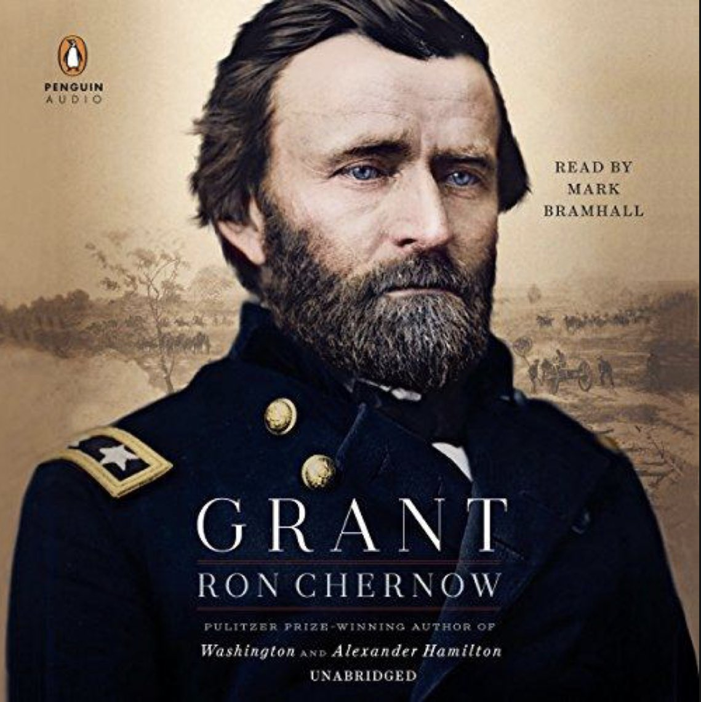

# Grant is incredible! 

What an incredibly illuminating book about someone I didn’t know much about before, 
but now have a profound reverence for. 
It is super informative on the time of reconstruction, it’s shortcomings, 
and prescient about the consequences of those shortcomings.

I highly recommend it.

# Some interesting things I learned:
- Grant was supposed to be at the theater with Lincoln the day he was assassinated.
- Lincoln was followed by Andrew Johnson after his assassination. He was handed the task of the reunification and reconstruction of a fractured nation and handled it terribly.
- Andrew Johnson vetoed the Civil Rights Act of 1866 and urged southern states not to ratify the 14th amendment. 
He also vetoed the First Reconstruction Act which required southern states to grant voting rights to black men.
- The KKK formed during the time of his administration, and they feared "black power at the polls"
- Grant was elected after Johnson, and continued Lincoln's legacy by focusing on reconstruction
- Grant created the Justice Department to help prosecute the KKK
- There was intense backlash to reconstruction, with one of Grant's advisors proclaiming "the new rebellion would be fought under the stars and stripes. The mistake made in 1861 was to have their own flag."

# Main take away
Unfortunately, against Grant's best efforts, it seems reconstruction was never truly completed, leaving lasting consequences for the country.

#### P.S.
I drew the art at the top :)

