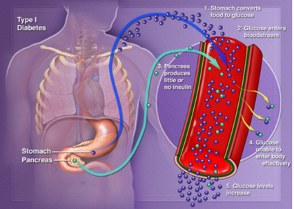
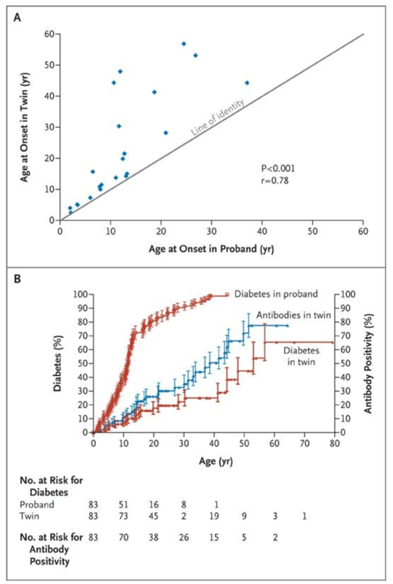
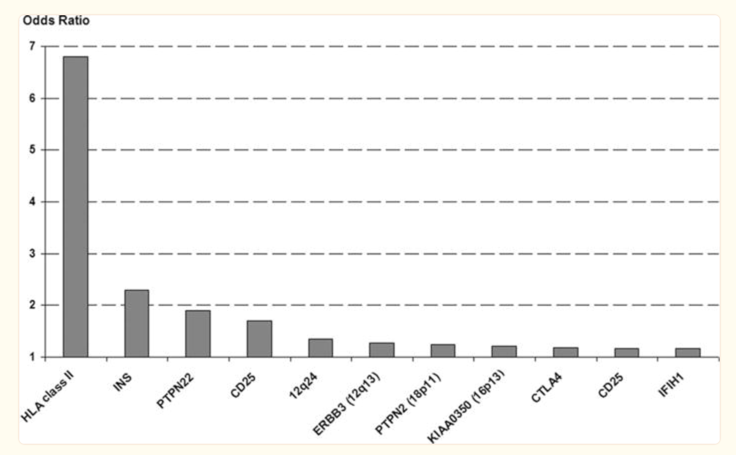
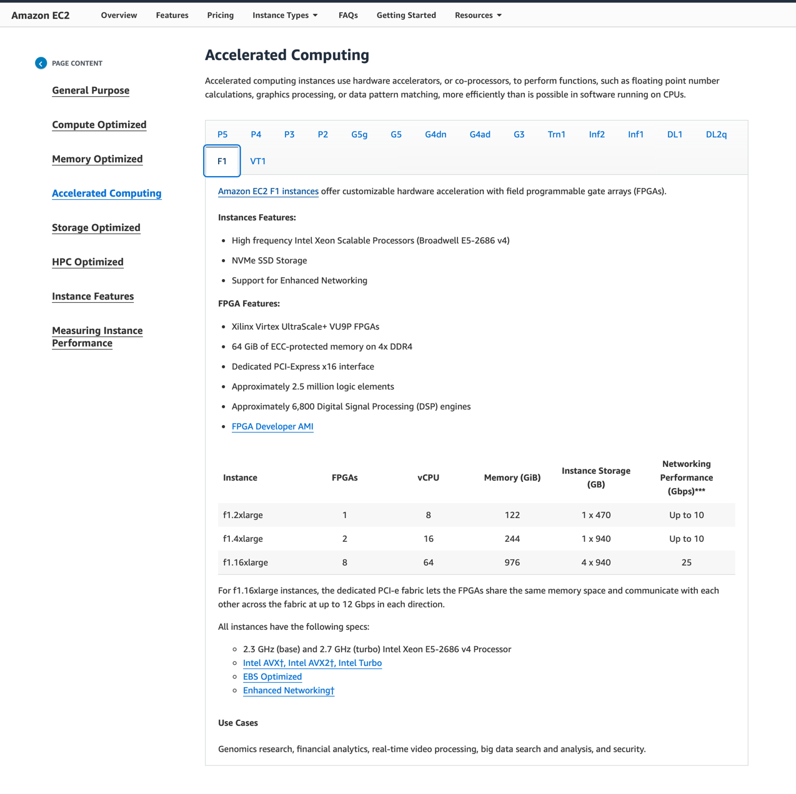
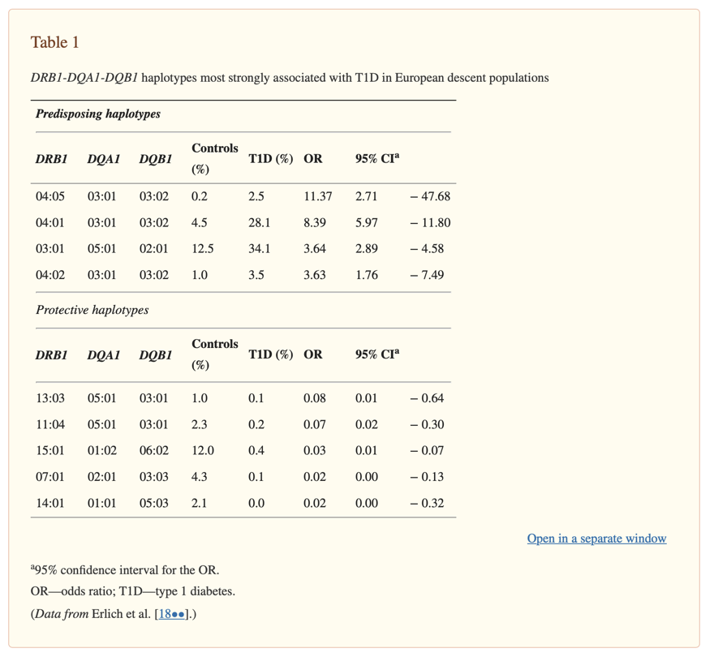

# Lost at sea 🌊
Beep Beep Beep.
As I look around the tiny gray inflatable dinghy bouncing along the choppy caribbean sea, I wonder who could possibly be beeping in the middle of the ocean.
Being miles from cell service made me doubt it was coming from a phone, and considering our distance from civilization I had doubts that it was coming from something outside the boat.
After turning my head each possible way to try to pinpoint the sound, 
I look down and realize that the sound is hard to pinpoint because the sound is coming from me;
my insulin pump just failed and is trying to alarm me to its sorry state.

And boy was my insulin pump in a sorry state, 
after furiously attempting to wipe off ocean water and praying for the right incantation of button mashes to bring it back to life, 
I finally accepted it was dead.

 
You can imagine this insulin pump, but with a gigantic error on the screen.

As someone with Type 1 Diabetes, I need insulin to survive, so having my only form of access to insulin basically fall over board could be described as "suboptimal".

But why do I need insulin to survive in the first place? The easy answer is easy, it's because I have type 1 Diabetes.
__But then why do I have type 1 diabetes?__ Well, now the rabbit hole begins, and we shall sally into our next adventure. We will leave the conclusion of the above story to another time, 
but I will give you with a slight spoiler, I find a way to carry on and live to write this very article!

## Type 1 Basics

Type 1 Diabetes is an autoimmune disease that effects my bodies ability to create insulin.
When I was 5 years old, my body decided that my own pancreas (an organ close to your stomach) looked rather suspicious, and decided to attack it 
(new research suggests that this process is not something that happens overnight, but can be a process that takes months or years).
The pancreas is responsible for creating insulin, and insulin is used to help take the energy in your food and make it accessible to your cells.

The image above from UCSF, while a little blurry, does a great job of explaining the steps that happen in the body.
1. The stomatch converts the food you eat into glucose
2. This glucose enters your blood stream
3. A normal pancreas would release insulin, so the glucose in the blood could move into cells, mine does not do that
4. Glucose levels increase

To combat increasing levels of glucose in the blood whenever I eat, I am tasked with the insane objective of being my pancreas.
Considering the pancreas has evolved over thousands of years to do this one thing, and I have trying to do its job for about 25 years, it can sometimes feel like I need some more experience 🤣.
I rely on [technology](https://dddiaz.com/post/loop/) to help me manage my disease (deliver insulin and monitor blood sugar) 
and I have some previous posts describing what goes into [that](https://dddiaz.com/post/ndam2021/).

## The beginning of why
Considering Type 1 Diabetes is a disease that effects [1.45 million americans](https://beyondtype1.org/type-1-diabetes-statistics/#:~:text=United%20States,Americans%20have%20type%201%20diabetes.)
, you would think we have firm grasp of what causes it. As described on the cdc [website](https://www.cdc.gov/diabetes/basics/what-is-type-1-diabetes.html#:~:text=Type%201%20diabetes%20is%20thought,years%20before%20any%20symptoms%20appear.)
we know the body accidentally starts attacking itself (aka the pancreas where insulin is produced), but beyond that we aren't entirely sure what triggers it.
We do know that some people have genes that are associated with type 1 diabetes, but this is not a guarantee of getting the disease.
An environmental trigger may play a part, maybe some sort of virus in conjunction with a genetic predisposition. 
(This [paper](https://pubmed.ncbi.nlm.nih.gov/36950864/#:~:text=Convincing%20evidence%20indicates%20that%20viruses,trigger%20for%20or%20unmask%20T1D.) argues Covid may have been a trigger for some people with T1D but more in depth studies are needed ).

As someone who has been living with Type 1 Diabetes for over 25 years, it's crazy to think we can't say for a fact what causes a disease that effects so manny. 
Regardless, on this journey of why, an obvious quest presents itself to someone interested in genomics: Can I find genes associated with type 1 diabetes in my own genome, is that even possible?

# On the hunt for 🧬
Figuring out where to start was quite difficult for me. My background is not biology, but actually computer science, but where there is a will, there is a way. 
So like any good computer scientist, I decided to start with Google (I have a feeling this sentence might instantly date me, maybe in the future people will say they start with ChatGPT). 
I had found a paper describing some simple SNVs or single letter variants in the genome (an A instead of a G in a certain position for example). 

To take a step back, remember that you can think of your genome as a recipe book for what makes you, you. Inside each of your cels your dna has the instructions to make everything from your big toe to your wavy hair.
Figuring what this recipe book actually says requires the help of some really technology called genome sequencers.
After we do that sequencing we get a gigantic file of As Gs Ts and Cs which represent the 4 letters that compose everyone's DNA. 
Your specific combination of As Gs Ts and Cs is what makes you unique.

I describe how I acquired my own genome and my simple analysis of these single letter variants here https://dddiaz.com/post/my-t1d-variants/.

While lots of fun and a good first step in my journey, 
I knew the complexity of the genetics of Type 1 Diabetes meant I needed to dive deeper to learn more.

After some non-specific meandering (aka clicking on links till I found something interesting), I had finally landed on these three papers which most of my analysis will center around:
- [Genetics of the HLA Region in the Prediction of Type 1 Diabetes](https://www.ncbi.nlm.nih.gov/pmc/articles/PMC3233362/)
- [Genetics of Type 1 Diabetes](https://www.ncbi.nlm.nih.gov/pmc/articles/PMC4874193/)
- [Banting Lecture 2009: An Unfinished Journey: Molecular Pathogenesis to Prevention of Type 1A Diabetes](https://www.ncbi.nlm.nih.gov/pmc/articles/PMC2844823/)
  - This paper is actually an incredible read and I can't believe it took me so long to discover it. 

## Establishing the Genetic Component of Type 1 Diabetes

[Source](https://www.nejm.org/doi/10.1056/NEJMc0805398?url_ver=Z39.88-2003&rfr_id=ori:rid:crossref.org&rfr_dat=cr_pub%20%200pubmed)

The above image comes from the paper titled [Concordance for Islet Autoimmunity among Monozygotic Twins](https://www.nejm.org/doi/10.1056/NEJMc0805398?url_ver=Z39.88-2003&rfr_id=ori:rid:crossref.org&rfr_dat=cr_pub%20%200pubmed)
and what it says is that if one identical twin had diabetes, there was a higher chance that the other twin would also get it, especially if the first twin got diabetes at a younger age.

Confusing note, so while the twin study establishes that there is a genetic component to type 1 diabetes, many people diagnosed with type 1 diabetes (>90%) have no 1st degree relative with type 1 diabetes ([paper](https://www.ncbi.nlm.nih.gov/pmc/articles/PMC2844823/#:~:text=do%20not%20have%20a%20first-degree%20relative%20with%20diabetes)).
When I was diagnosed, no one in my family had type 1 diabetes, although recently that changed when my cousin was diagnosed with type 1.

So there is possibly more at play, regardless, we know your genes play some part.

## Genes?
If your entire genome can be thought of as a recipe book for you, you can think of genes as individual recipes in that book.
There is a recipe to control everything from your hair, eye color, and even height. 
You get a set of genes from your mom and a set from your dad. 
It's the reason someone might say you have your dad's nose, or your mom's hair. 


Genes also control some aspects of your immune system. 
The more papers I came across, the more I realised that these [immune system genes were important in understand my own type 1 diabetes](https://www.ncbi.nlm.nih.gov/pmc/articles/PMC2844823/#:~:text=is%20most%20important%20for%20the%20development%20of%20type%201%20diabetes).
More specifically something called __HLA__.


[source](https://www.ncbi.nlm.nih.gov/pmc/articles/PMC4874193/figure/F1/)

You can see when they studied whole groups of people with type 1 diabetes (also known as Genome Wide Association Studies), HLA seems to be the most critical for the development of type 1 diabetes.


Source: https://www.ncbi.nlm.nih.gov/pmc/articles/PMC2844823/figure/F4/

## HLA

Ok, so HLA is important, but what is it?

According to wikipedia, "The human leukocyte antigen (HLA) system or complex is a complex of genes on chromosome 6 in humans which encode cell-surface proteins responsible for regulation of the immune system" [link](https://en.wikipedia.org/wiki/Human_leukocyte_antigen#:~:text=The%20human%20leukocyte%20antigen%20(HLA,MHC)%20found%20in%20many%20animals.).

So in other words, HLA controls some proteins that are on the surface of cells in your body, and help your body distinguish between good cells (hey this looks like my leg), to bad cells (hey this looks like some nasty bacteria, probably from that cut I got the other day.)

Ok, so if we combine that piece of information with the fact that Type 1 Diabetes is an autoimmune disease where the body attacks its own insulin producing cells (called islet cells in the pancreas), its starts to make sense why HLA is a critical genetic signal for the development of type 1 diabetes.
This [paper](https://www.ncbi.nlm.nih.gov/pmc/articles/PMC3233362/#:~:text=To%20date,%20although%20the%20HLA%20class%20II%20DRB1-DQA1-DQB1%20genotypes%20are%20widely%20recognized%20as%20the%20strongest%20genetic%20risk%20factors%20for%20T1D) explains, 
"the HLA class II DRB1-DQA1-DQB1 genotypes are widely recognized as the strongest genetic risk factors for T1D" 
and goes into more biological detail on the intricacies of HLA.

In particular, it calls out the HLA Alleles we should look for.
- The DR-DQ haplotypes conferring the highest risk are DRB1*03:01-DQA1*05:01-DQB1*02:01 (abbreviated “DR3”) and DRB1*04:01/02/04/05/08-DQA1*03:01-DQB1*03:02/04 (or DQB1*02; abbreviated “DR4”). 
- Some haplotypes confer strong protection from disease, such as DRB1*15:01-DQA1*01:02-DQB1*06:02 (abbreviated “DR2”; OR = 0.03; 95% CI, 0.01–0.07).

The way the HLA Genes are labeled is kind of wonky, luckily we can use the paper above to understand the labeling a bit more. 
They [explain](https://www.ncbi.nlm.nih.gov/pmc/articles/PMC3233362/#:~:text=The%20emergence%20of%20DNA-based%20genotyping%20led%20to%20the%20creation%20of%20a%20nomenclature), 
"The emergence of DNA-based genotyping led to the creation of a nomenclature system that included the locus name, 
followed by an asterisk, followed by a numerical designation for the allele (eg, DRB1*04:05). 
In the previous example, the “04” refers to the serologic group of the DRB1 allele, and the “05” refers to the individual allele within the DRB1*04 group."

That makes it slightly more clear, but once we have my own genes in hand, I hope it will start to make more sense.
I will do some hand waving here, and just say that after reading the paper, its clear we need a way to inspect what HLA Class 2 Genes (encoding DQ and DR) I have, and for that we will need Dragen!

# Dragen to the rescue 🐉


Dragen (Disclaimer: I help work on this! 😊) is a piece of software that looks at your DNA Sequence 
and determines where the variants are. 
It uses a bunch of very fancy Bioinformatics Algorithms, FPGA Tech, and Machine Learning. 

But when I started on this journey, it did not support HLA class 2 calling.
Luckily that all changed with the release of [Dragen 4.2](https://developer.illumina.com/news-updates/dragen-4-2-enhanced-machine-learning-new-targeted-callers-and-more)

## Running Dragen 4.2 on my own genome
As I mentioned earlier, Dragen is a piece of software, but one caveat to mention is that it runs on special hardware called an FPGA. 
In practice, this is like having a graphics card in your computer that only does genomics. 
It makes everything super fast.

So to begin, we need to spin up a special ec2 instance called an F1.

As you can see, these are very powerful machines, and it needs to be that powerful to analyze the massive amount of data that is our genome.

Once we have the instance, we load my genome onto it. 
My genome is stored as a BAM file, and this represents all the As Gs Ts and Cs that make me, well me.

From there we run this somewhat magical Dragen Command:
```bash
dragen \
--enable-hla=true \
--hla-enable-class-2=true \
--enable-map-align=true \
--enable-sort=true \
--output-directory=/home/centos/results \
--output-file-prefix=DDD \
--bam-input=/home/centos/genome/MYGenome.bam \
--ref-dir=/home/centos/ref_dir 
```
The flag I want to call out here, that wasn't available before is:
```bash
hla-enable-class-2=true
```

We let that run for a couple of minutes, remember we are running Dragen on a server with an FPGA Card, so we won't have to wait long for the analysis to complete, and once the command finishes we get a bunch of variant call files.

## Inspecting the output

Okay, so the time you all have been waiting for, my HLA Genes.

HLA Class II Genes Encoding DQ

| DQA11      | DQA12      | DQB11      | DQB12      |
|------------|------------|------------|------------|
| DQA1*03:01 | DQA1*01:02 | DQB1*06:04 | DQB1*03:02 |

HLA Class II Genes Encoding DR

| DRB11      | DRB12      |
|------------|------------|
| DRB1*13:02 | DRB1*13:02 |

# The crowd goes wild... for analysis 🤴
OK so let's analyze the data, comparing with what the [paper](https://www.ncbi.nlm.nih.gov/pmc/articles/PMC3233362/) found:



According to the paper, "The DR-DQ haplotypes conferring the highest risk are DRB1*03:01-DQA1*05:01-DQB1*02:01 (abbreviated “DR3”) and DRB1*04:01/02/04/05/08-DQA1*03:01-DQB1*03:02/04 (or DQB1*02; abbreviated “DR4”). 
The risk is much higher for the heterozygote formed by these two haplotypes (OR = 16.59; 95% CI, 13.7–20.1) than for either of the homozygotes (DR3/DR3, OR = 6.32; 95% CI, 5.12–7.80; DR4/DR4, OR = 5.68; 95% CI, 3.91)."

In other words the highest risk is if you have some form of the DR3 genes from one parent and DR4 genes from another parent.

Let's see what I have:

On Initial Inspection, it's clear that I have two gene matches. 
For context each gene in the table is repeated twice, once for the gene you get from mom, and once for the gene you get from dad.
So based on the first table of my HLA Class II Genes Encoding DQ, I have one copy of the Gene DQA1*03:01 and one copy of the gene DQB1*03:02. 
And they seem to have come from different parents.
I don't seem to have any matches for the DRB Gene.
Now if I input that into the table, where I replace non-matching genes with a dash I get this.


| DRB1 | DQA1       | DQB1       | Controls % | T1D % | OR    |
|------|------------|------------|------------|-------|-------|
| -    | DQA1*03:01 | DQB1*03:02 | 0.2        | 2.5   | 11.37 |
| -    | DQA1*03:01 | DQB1*03:02 | 4.5        | 28.1  | 8.39  |
| -    | -          | -          | 12.5       | 34.1  | 3.64  |
| -    | DQA1*03:01 | DQB1*03:02 | 1.0        | 3.5   | 3.63  |

Based on my analysis, 
I have 2 out of the 3 genes that could confer increased susceptibility to Type 1 Diabetes, but critically I am missing the DRB1 Gene.
If my understanding of the paper is correct, 
I would need all 3 genes to have the particular haplotypes (haplotype in this case being the set of 3 genes.) associated with increased risk.

## My interpretation
As described in the paper, ["The strongest associations between T1D and the HLA region are seen with haplotypes and genotypes formed by the DRB1-DQA1-DQB1 loci"](https://www.ncbi.nlm.nih.gov/pmc/articles/PMC3233362/#:~:text=The%20strongest%20associations%20between%20T1D%20and%20the%20HLA%20region%20are%20seen%20with%20haplotypes%20and%20genotypes%20formed%20by%20the%20DRB1-DQA1-DQB1%20loci).
While it is clear I have two genes in the haplotype, I do not have the thrid.
This may be confusing to the reader, as I explained earlier I have type 1 diabetes, but do not seem to have the strongest genetic risk factor.
The paper goes on to say ["HLA remains, by far, the strongest predictor of T1D risk, consistent with the idea that the human genome is prone to develop T1D when mutations in genes controlling tolerance override the normal polygenic prevention of autoimmunity. However, the complexity of the genetics of T1D is greater than might have been predicted by the early reports."](https://www.ncbi.nlm.nih.gov/pmc/articles/PMC3233362/#:~:text=the%20complexity%20of%20the%20genetics%20of%20T1D%20is%20greater%20than%20might%20have%20been%20predicted%20by%20the%20early%20reports)

This resonates with me, as it is clear I have type 1 Diabetes, but I do not have the set of 3 autoimmune genes that confer the strongest association.
What this means at a high level is that I either have genes not described in this analysis (very possible), there are other genes out there that are connected to t1d that are not yet undertood (also likely), or I got my type 1 diabetes from another mechanism not yet understood (also possible).

To be perfectly honest, that is not exactly the result I expected, but that is okay! In a perfect world I would have looked at my HLA Variants and been able to say, oh I have this variant assocaited with disease.
But at this exact moment, I can not do that, and again that is okay!
This just means that more research is needed to understand this disease, more science is needed to under the genetics of immunology, and more people are needed to help. 💪

# More to come ⛵️
And so we reach the end of this short jaunt into my own genome, but just the beginning of a lifelong adventure.

That young guy on a boat in the middle of the caribbean ocean had a lot of questions, mostly around how he got himself into that situation, and today he still has a lot of questions, also mostly around how he got himself into this situation. 🤣 

Before I leave, I want to add a major disclaimer to everything you just read, I am by no means an expert on immunity, genomics, biology or even diabetes for that matter.
I am still learning every day, especially when it comes to managing/understanding my own disease, but I hope you came away with something interesting.

Until next time, I cant wait to see what new research/invention/technology comes out that makes diabetes and this crazy world easier to understand.

## Feedback
Feedback is a gift, feel free to reach out if you have any. I am available on LinkedIn [here](https://www.linkedin.com/in/dddiaz/) or talk to me in person!

## Quote
"Too much sanity may be madness — and maddest of all: to see life as it is, and not as it should be!" Miguel de Cervantes Saavedra, Don Quixote

## You might also like
If you thought this post was interesting, you might like this post where I participate in my first Type 1 Diabetes clinical Trial: https://dddiaz.com/post/clinical-trial-1/

# Links

- [Dragen HLA Caller](https://support-docs.illumina.com/SW/dragen_v42/Content/SW/DRAGEN/HLACaller.htm?Highlight=hla)   
- [T1D Stats](https://beyondtype1.org/type-1-diabetes-statistics/#:~:text=United%20States,Americans%20have%20type%201%20diabetes.)  
- [Genetics of the HLA Region in the Prediction of Type 1 Diabetes](https://www.ncbi.nlm.nih.gov/pmc/articles/PMC3233362/)  
- [Genetics of Type 1 Diabetes](https://www.ncbi.nlm.nih.gov/pmc/articles/PMC4874193/#:~:text=These%20include%20the%20insulin%20gene,receptor%2C%20alpha%20(IL2RA)%20and)  
- [Banting Lecture 2009: An Unfinished Journey: Molecular Pathogenesis to Prevention of Type 1A Diabetes](https://www.ncbi.nlm.nih.gov/pmc/articles/PMC2844823/)  
- [Concordance for Islet Autoimmunity among Monozygotic Twins](https://www.nejm.org/doi/10.1056/NEJMc0805398?url_ver=Z39.88-2003&rfr_id=ori:rid:crossref.org&rfr_dat=cr_pub%20%200pubmed)  
- [What is HLA](https://www.merckmanuals.com/professional/immunology-allergic-disorders/biology-of-the-immune-system/human-leukocyte-antigen-hla-system)   
- [Advancing the science](https://dddiaz.com/post/clinical-trial-1/)  
- [Previous T1D Variants Post](https://dddiaz.com/post/my-t1d-variants/)  
