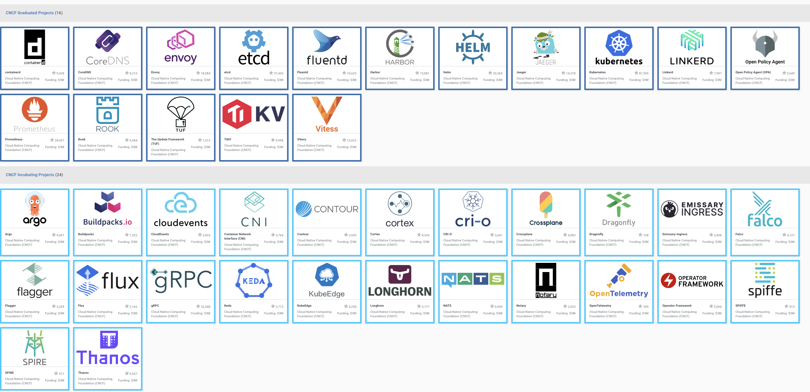
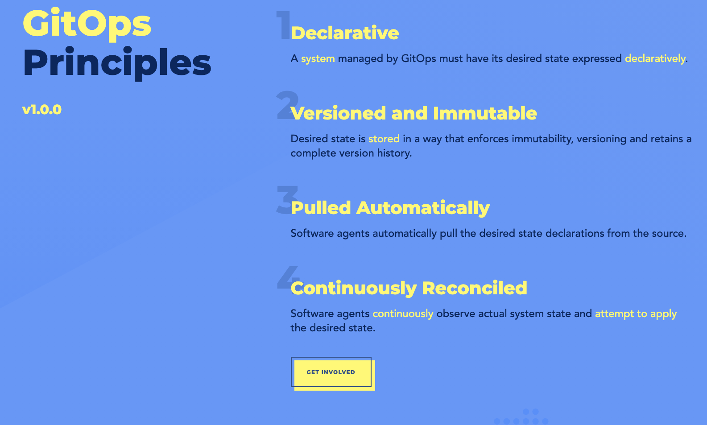

# What is it:
"The Cloud Native Computing Foundation’s flagship conference gathers adopters and technologists from leading open source and cloud native communities."

# What I think it is:
A wonderful conference targeting users, developers, and maintainers of cloud native open source technology. Kubernetes (An open source container orchestrator) being the biggest, but not only focus (Other big CNCF projects include Prometheus, fluentd, containerd (docker alternative)).

# Wait, what are the projects under the CNCF (Cloud Native Computing Foundation)?
You are probably using a few! Here is a full [list](https://landscape.cncf.io/?project=hosted):

Here is a snapshot of some of that list:

# Sessions Attended:
Considering I recently changed teams, I made sure to focus more on CI/CD sessions than standard Kubernetes Sessions.

#### Manage more clusters with less hassle, with Argo CD Application Sets
Jonathan West - Red Hat

#### EKS Anywhere

#### GitOps + Jenkins-CI with Declarative Everything
Weaveworks

#### Flux and Jenkins 
Kingdom Barrett

#### SIG Events: Using CloudEvents to create an Interoperable CI/CD Ecosystem
Andrea Frittoli - IBM

#### Security Through Transparency

# Session / Conference  Highlights:

## GitOps Formal Definition
A nice reminder of the core [motivators](https://opengitops.dev/#principles)

## Event based systems for CI/CD is an extremely cool idea!
Having an event like environment created, or pipeline started, or test failed, be able to trigger multiple other different systems could be extremely nifty.
I think aws has native cloud events tool called: https://aws.amazon.com/eventbridge/ which may be worth exploring further as well
The cloud native project is called [cloudevents](https://cloudevents.io/)

## Open Telemetry
I didn't see a specific session about this, but I learned this existed, and I am extremely interested. 
This is a Vendor agnostic way to receive, process, and export telemetry data, and if It's anything like NewRelic, I can imagine a lot of use cases!
It is definitely something I want to explore further.
Heres the [url](https://opentelemetry.io/): 

## Cool Projects I want to look into further:
- https://aws.amazon.com/eventbridge/
- https://cloudevents.io/
- https://argo-cd.readthedocs.io/en/stable/
- https://opentelemetry.io/
- https://containerd.io/
- https://www.jenkins.io/doc/book/installing/kubernetes/

# Summary

This was my first major conference since the pandemic started.  
I want to note that proof of Vaccination and Masks were required during the event... and I think that is a good thing.

What really sets this conference apart is its focus on developers.
I have been to other conferences pre pandemic, and they were like gigantic sales pitches to management.
This conference was different in that it seemed to explicity target the people who are working and implementing these nifty technologies.

Events and Serverless architectures (with knative) are continuing to gain traction and they will continue to force us to think a little differently about how we connect our systems.

OpenTelemtry was also a very cool stand out for me, and I can't wait to explore how that can be used.

Overall, it was definitely a little weird being somewhere in person, but still a cool experience.

