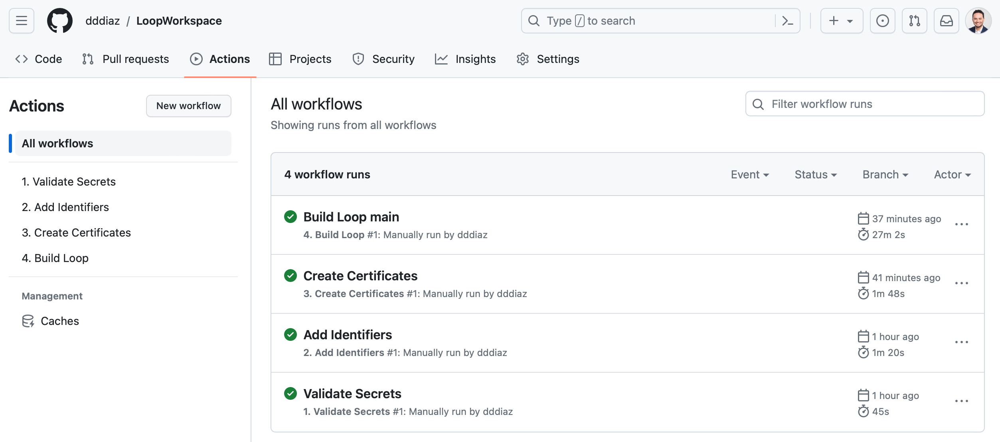
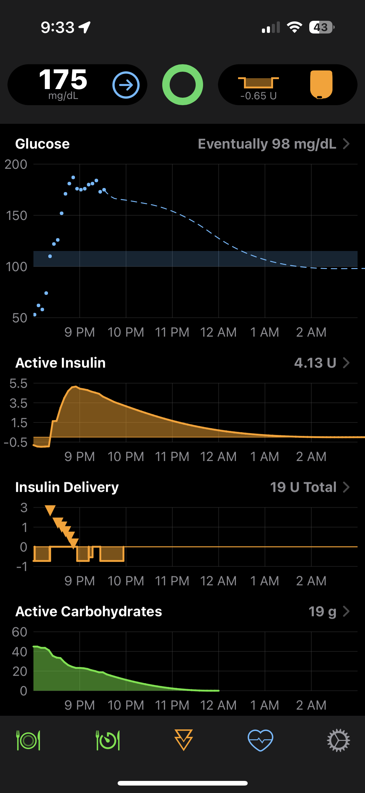
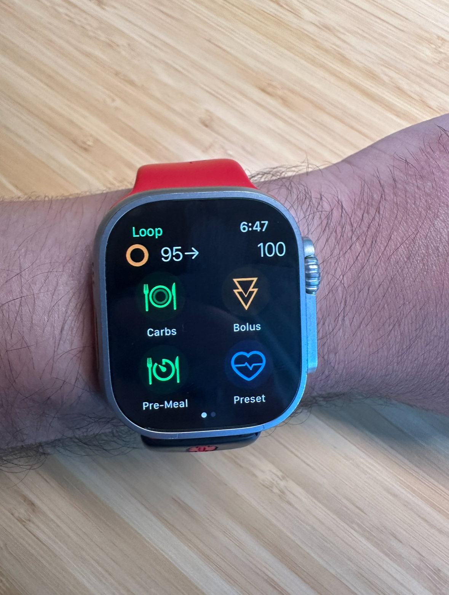
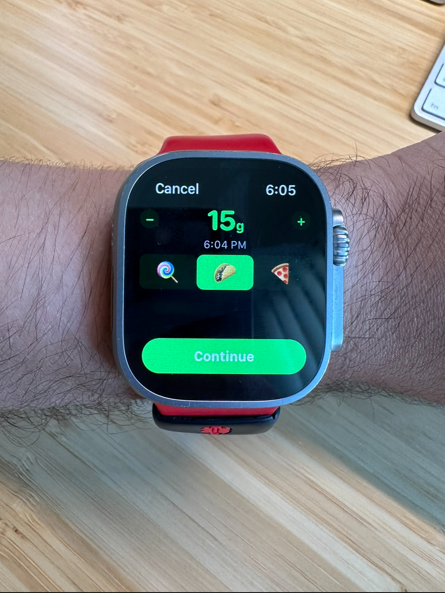

I have had Type 1 Diabetes for over 25 years and today on World Diabetes Day I want to celebrate the most impactful open source project I have ever used. Before I can talk about that though, I have to set the stage for a moment.

Type 1 Diabetes is an auto-immune disease that can not be prevented and has no cure. The immune system kills the insulin producing beta cells in your pancreas, meaning you have to manually inject Insulin for the rest of your life. Insulin is required to take the energy in the food you eat, and move it across the cell membrane so your cells can use it. Without Insulin, you will die. I wrote a blog post a couple years ago about all the technology I use to help me manage this chronic illness (https://dddiaz.com/post/ndam2021/), and this post will be an update to that.

Also, I would be remiss if on world diabetes day, I did not mention the early symptoms of Type 1 Diabetes, so YOU can potentially identify them early: 

> - Excessive thirst
> - Frequent Urination
> - Unexplained Weight Loss
> - Exhaustion

Keep an eye out for symptoms like that, and see your doctor ASAP if you think you may have Type 1 Diabetes. 

# Ok, now onto the juice 🧃.

One of the tools I use to manage my diabetes is an insulin pump. This is a device I wear on my body that has a reservoir of insulin that can be delivered subcutaneously. This device historically was controlled by a dismal android app on a locked down android phone. Imagine if your pharmacy made an app that you were required to use every time you ate, yes its as bad as you can imagine. 🤣

I am someone who absolutely loves technology, and while having an insulin pump that could be controlled by a phone was cool, it left a lot to be desired. I had just recently purchased the newest apple watch ultra and it totally hooked me with images and ideas of climbing mountains. The idea of being able to use something like that, to also control my insulin pump is something I hoped would not be far away. For now though, I would have to imagine climbing those awesome mountains with a clunky locked down android phone that had a terrible battery life, and would frustratingly only charge with certain usb c cables. 

# But it turned out that dream was not as far as I thought ⌚️

A community of extremely motivated caregivers/engineers/diabetics, also known as the “We Are Not Waiting Community” decided to do just that. They decided not to wait any longer for insulin pump manufacturers to get with the program, and decided to reverse engineer the insulin pump so they could make their own diabetes management ecosystem.

(See [Paper](https://www.ncbi.nlm.nih.gov/pmc/articles/PMC8865793/), See [Organization](http://www.nightscout.info) )

# Give Thanks 🙏

Before I proceed, I want to explicitly thank this community of incredible people for everything I am about to describe would not be possible without them, and they truly deserve all the credit. They have made my life dramatically easier and more enjoyable at absolutely no cost to me. Truly selfless and admirable. 

# Say Hello to [Loop](https://loopkit.github.io/loopdocs/#welcome-toloop) ➰

Loop is an open source iOS app that allows you to manage your diabetes from your iPhone and Apple Watch! It has the ability to control certain insulin pumps (they reverse engineered the bluetooth insulin pump protocol to make that possible ) and communicate with existing continuous glucose monitors (I wear one called the Dexcom g7).

The interface is beautiful and intuitive. Seems like it was actually designed for humans rather than doctor demos. The app is also tune-able, where you can turn on and off certain feature flags if you prefer, including certain experimental insulin dosing algorithms (totally optional of course).

There is one major caveat though. You need to build the iOS app yourself and load it onto your phone. But wait, I haven’t built any iOS apps since college. Uh oh. If only there was some automation to make this easy.

# Github Actions to the rescue! 🔐

The “We are not waiting” and loop community created a Github Action to build the entire iOS app and make it available on TestFlight. All I had to do was clone the repo, set up the credentials, and run the Github Action! Technically you don’t even need to own a mac, as the action runs in the cloud. Incredible!

# Present Day 😎

I have been using Loop for a couple months now, and I absolutely love it. The algorithm included with loop does a better job at correcting high blood sugars then the one created by the insulin pump manufacturer in my opinion (It uses a better PID controller [Proportional–integral–derivative_controller](https://en.wikipedia.org/wiki/Proportional%E2%80%93integral%E2%80%93derivative_controller)) 

This is what the home screen looks like on the iPhone.

At the top you will see my current glucose, which is pulled from the continuous glucose monitor I am wearing.
Under that you will see how much active insulin I have in my system, which the app tracks based on how much has been deliverd.
Below that you will see how many carbs I have in my system based on food I have entered, which is used to help make bolus decisions and corrections.

And of course, now I can control my insulin pump from my watch! 

This is awesome! I can give myself a bolus without having to bring out that cursed locked down android phone. I can be on top of a mountain (or err meeting which is more likely), and in a couple taps on my watch, be managing my diabetes. 

Even cooler, when I bolus on the watch I can specify the absorbtion rate of the food by clicking the candy, taco, or pizza icon, and that will effect the calculation on how much insulin I need.

Honestly technology is incredible!

# Summary ⛵️

- I can initiate a bolus from my apple watch thanks entirely to the incredible “We are not waiting” community and the open source Loop project.
- Github Actions are incredibly powerful and can even build and deploy iOS apps.

# How you can help 🥳

Open Source Links: 

Loop: https://github.com/LoopKit/Loop (The App that runs on my watch on phone to control my pump)

NightScout: https://github.com/nightscout (An open source tool to generate reports on glucose data to help management)

Keep an eye out for any of the Type 1 Symptoms I mentioned above!
