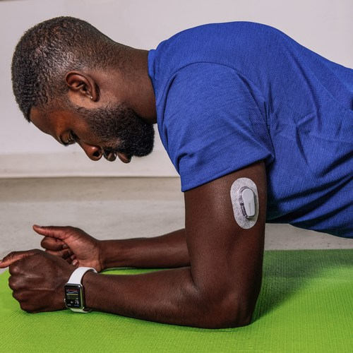
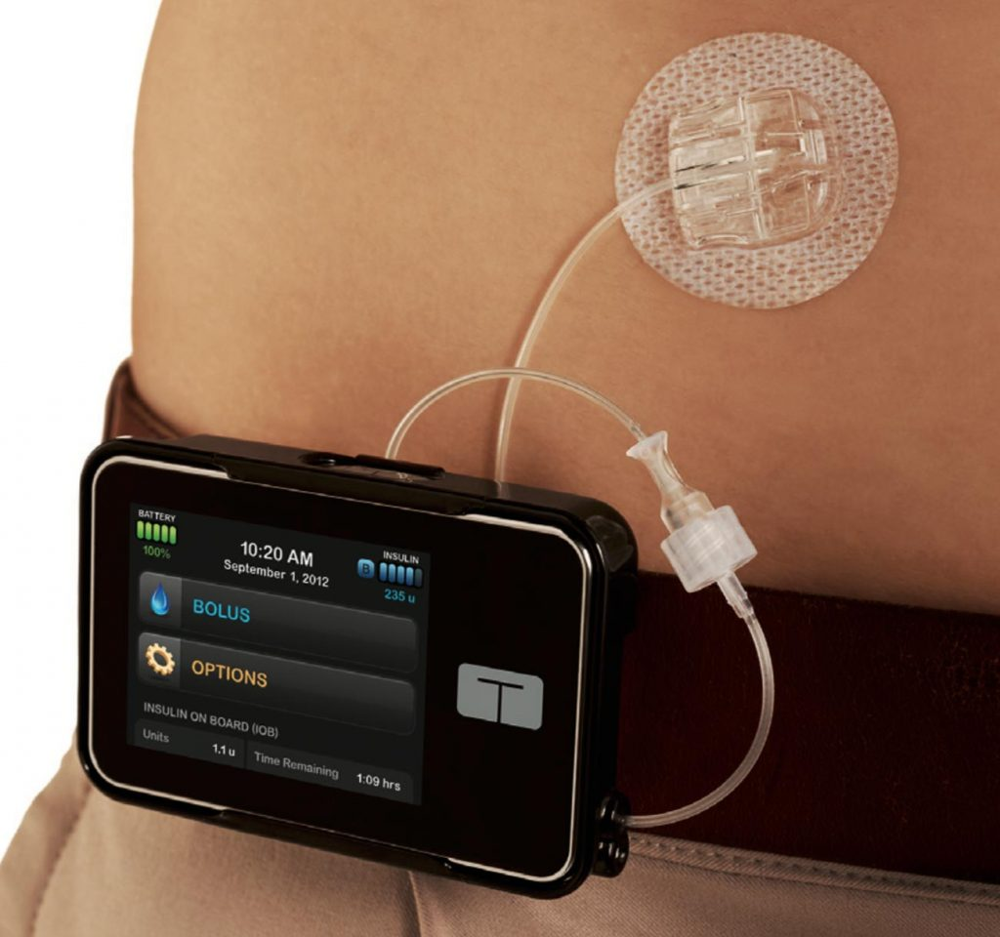
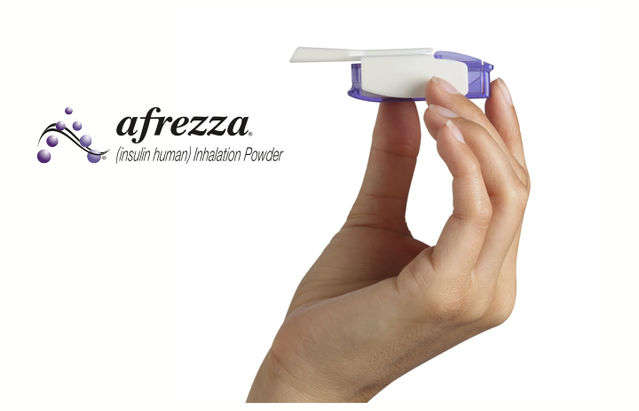
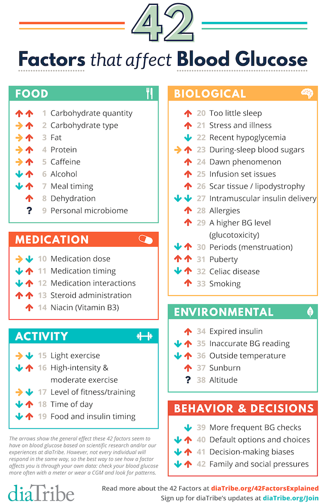

# What is Type 1 Diabetes 💉
Type 1 Diabetes is a chronic autoimmune disease where your immune system destroys the insulin producing cells (also called beta cells) in your pancreas. 
Without insulin, you can't use the energy in the food you eat!

# What are the symptoms of Type 1 Diabetes ❤️
- Excessive thirst
- Frequent Urination
- Unexplained Weight Loss
- Exhaustion  

If someone you care about is exhibiting these symptoms, get them to a doctor!

# Is there a cure? ✨
There is no cure for Type 1 Diabetes and no amount of diet or exercise will make it go away. 
It is an autoimmune disease!

# What causes it? 🔥
We actually don't know... 

Our best estimate is that it is some combination of genetics and autoimmune wackiness.
People are working extra hard to figure it out, but to their credit biology is ridiculously complex.

# How do you manage it (📟)
Since my body does not produce Insulin, I need to manually inject it to keep the glucose in my blood from becoming toxic. 
At the simplest level there are things that raise blood sugar (e.g. food, stress, hormones, certain types of exercise) and things that lower blood sugar (mainly insulin).
The goal is balance all the possible factors that can effect blood sugar in an attempt to stay in a somewhat normal blood sugar range.

A person without Diabetes can have a blood sugar that ranges from 80-150.

To try and be in this range, we have several tools at our disposal.
The tools I use are the following:
- Dexcom CGM connected to an Apple Watch
- Insulin
- Tandem Insulin Pump with the ControlIQ Algorithm
- Afreeza (Inhale-able Insulin)

## Dexcom CGM
This is a device I wear on my arm, kind of like this:

I have to change it ever 10 days, and it has a filament that sticks into my body to measure glucose.
It makes a reading every 5 minutes and wirelessly sends that data to my iphone / Apple Watch ⌚ and my Insulin Pump (which I will describe later).

#### Why is this so important?
Just like in life, it's important to not only know where you are, but where you are going.

Before continuous glucose monitoring, I would have to base all my treatment decisions on a single number. 
That number couple be going up dramatically or down, and I would have no idea.

With a CGM I now have an indication of what direction my blood sugar is trending!

Here is an example of what that looks like:

I can look at this graph (on my iPhone or Apple Watch) and extrapolate that while I am currently 139, I am still clearly still heading downward, into "low blood sugar" territory.
That information is vital to informing me how I should adjust my treatments. 
In this case I may want to have a snack, or lower the amount of insulin I may have for a meal, or avoid exercise without eating.

This also gives me a huge peace of mind when sleeping, because now if I am starting to go "low" while I am sleeping, and can have my phone alert me.
(Hopefully waking me and averting a disaster.)
That can be a huge relief for people who live alone, or parents of kids of type 1.

>Needless to say, the single biggest improvement to my diabetes management has been the continuous glucose monitor.

## Insulin
Insulin is the hormone my body does not produce.
Insulin is produced in the pancrease by Beta Cells.
Insulin is what allows glucose to traverse the cell membrane and be used by your cells.
Insulin is what brings down blood sugars.

## Insulin Pump
This is another vital tool in the tool box. I wear a pump called the Tandem Insulin pump, and it looks something like this.

This pump has a reservoir of insulin inside it that can last 3 days.
The reservoir and the pump site have to be changed every 3 days. 
Since this pump is attached to my body, it can inject insulin as needed.

Where it gets really cool is this new algorithm called ControlIQ.

Even when you are not eating, your body still needs insulin.
We call this base insulin rate, BASAL.

ControlIQ allows the insulin pump to wireless connect to the continuous glucose monitor mentioned above to get real time data.
Based on this data, it can adjust the basal rate it delivers in real time!

While this isn't a silver bullet, this is a step in the direction of an automated insulin delivery system.

## Affreeza
This is a new inhalable insulin product that I use.
It has unique pros and cons but its main advantage is that it has an extremely fast activation time as compared to normal insulin.
In some cases, it can be too fast! 

# So why all the effort to be "in range" 😅
When my blood sugar is too high, I can experience:
- Nausea
- Blood Vessel Damage
- Irritability
- Headache

When my blood sugar is low I can experience:
- confusion
- weakness
- blurred vision
- chills
- slurring
- memory loss
- seizures

Typically, in the short term being low is more dangerous than being high, but chronic high blood sugars over the long term can have serious health implications.
These complications are quite scary, and for my own sanity, I won't list them here 😅😅😅

# So is managing Diabetes as simple as just using these tools?
These are some other factors that can effect blood sugar...

The technology makes it easier, but with so many variables it is not easy. 😉
Remember, at the end of the day, I am trying to manually replicate the behavior of a whole organ (pancreas)!

# Struggles 💪
I clearly have a lot of tools to help me successfully manage my diabetes and extend my life, but I want to be clear, not everyone is as privileged as I am.

Insulin is the bare minimum needed to manage Diabetes, and yet in the United States
> 1 in 4 Diabetes have had to ration insulin because they couldn't afford it!

The Continuous Glucose Monitor which I mentioned as being one of the single greatest resources for my management is available to even fewer.
Less that 10% percent of Diabetics are using a continuous glucose monitor to manage their diabetes. 

*I will leave it as an exercise for the reader to ask themselves what systems and incentives exist to allow the above injustices to persist.*

# Community 🙌
There is some good news though.
It is sometimes said that the type one community  
> "is the coolest club you never want to be a part of"

And I have to admit, it is totally correct.
The people I have met with Type 1 are all absolutely incredible.
They are also role models for me to look up to, because each one brings a unique drive and perspective that reminds me that my goals, my dreams, my aspirations are all still possible.
They inspire me!

# Conclusion 🚀
Hope you learned a bit about me, and my Diabetes. If you made it this far, thank you :)

#### P.S
I have some other cool posts about diabetes you may like [here](https://dddiaz.com/tags/diabetes/)
I have everything from converting glucose numbers to sound, to doing machine learning on my blood sugar to predict when I exercised.

#### P.P.S
Check me out on Twitter! I sometimes post about Type 1 Diabetes stuff on there!

