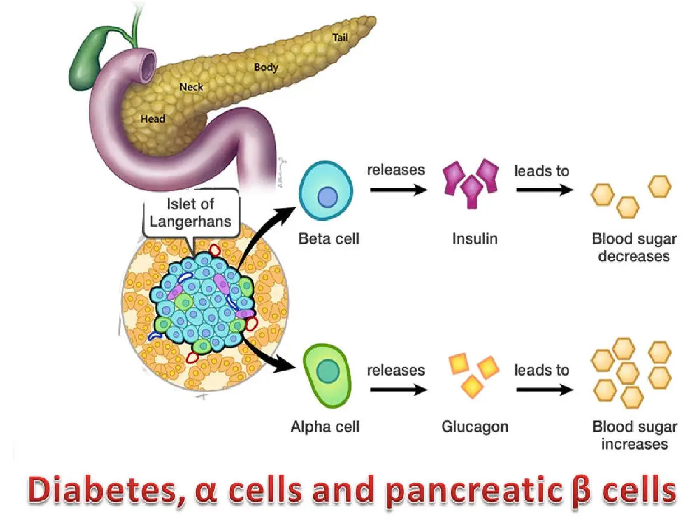
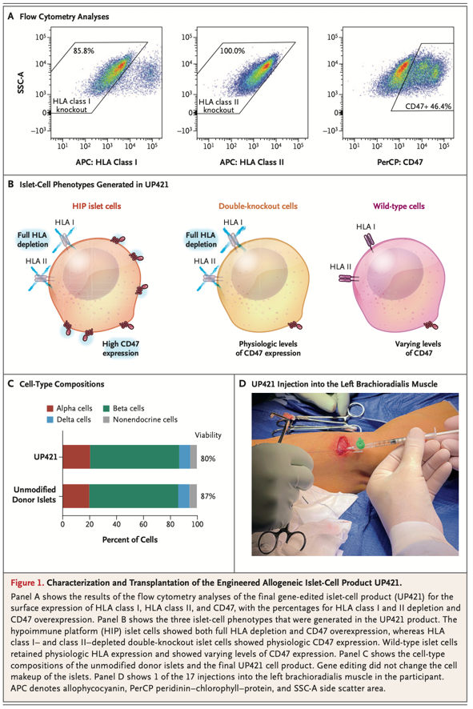
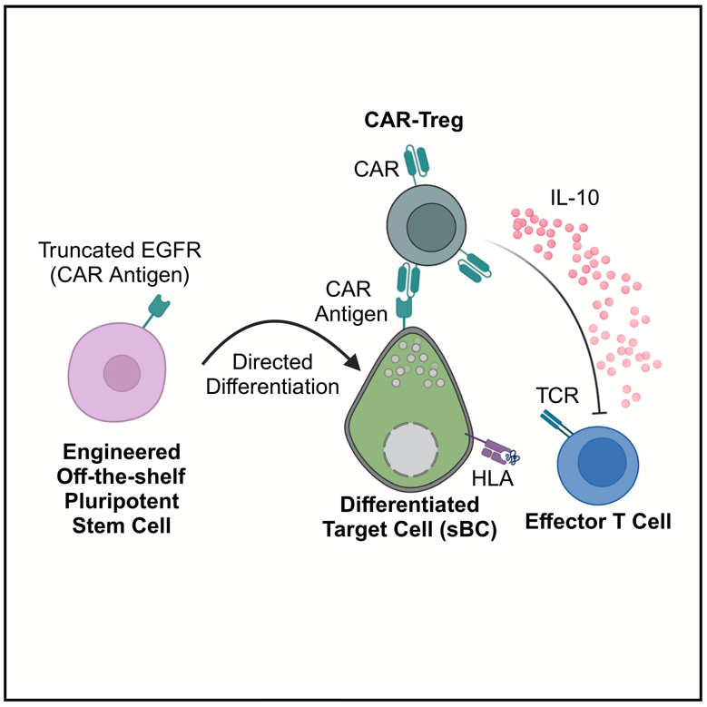

I have had Type 1 Diabetes for over 28 years, and for the entirety of my diagnosis people have said that a cure is 5 years away. 
It has become a little bit of a running joke in the diabetes community, but now I am starting to believe that a cure is not that far off.
Let me show you what I have learned as part of a recent presentation I did.

# 🧬 Quick T1D Background
Type 1 Diabetes is an autoimmune disease. 
My immune system attacked and destroyed the beta cells in my pancreas that make insulin. 
Insulin is the hormone that allows the body to move glucose from the bloodstream into cells for energy.
Without insulin glucose stays in the blood becoming life-threatening, so I need to inject it manually throughout the day.

The way to cure Type 1 Diabetes is straight forward in theory then, replace the insulin producing beta cells. 
But there is a problem, as soon as my immune system sees those beta cells, it will attack and destroy them again.
So a cure requires restoring beta cell function AND preventing renewed immune attack.

# 🛡️ Strategy 1: Immune Evasive Replacement

What if we could engineer beta cells that are invisible to the immune system?

This is what HLA Knockout attempts to do. But how does it work? To understand that we need a brief overview of T Cells.

T Cells are your body's immune system cells that recognize a cell as "foreign". This is how they do it:
1. Every cell displays little protein fragments on its surface using HLA molecules (think of them as "ID badges")
2. T cells scan these ID badges looking for foreign proteins
3. If they find something suspicious, they kill the cell

The key insight: remove the ID badges entirely. No HLA molecules = nothing for T cells to recognize.

Researchers:
- **Knocked out HLA Class I and Class II** genes 
- **Overexpressed CD47** - The "don't eat me" signal for macrophages and natural killer (NK) cells.

In stem cell-derived beta cells that they engineered.

The result is cells that are essentially invisible to the immune system.

## 🧑‍🔬 Clinical Proof

In September 2025, a [paper](https://www.nejm.org/doi/full/10.1056/NEJMoa2503822) in the New England Journal of Medicine described the first human trial of these cells.

**The patient**: 42-year-old male, 37 years with T1D
**The dose**: 79.6 million HIP islet cells
**The location**: Forearm muscle
**Immunosuppression**: None.

Results at 12 weeks:
- **C-peptide levels were stable** - meaning the cells were making insulin
- **Glucose-responsive insulin secretion** - the cells responded to blood sugar levels
- **No serious adverse events**

This worked in a human. Not a mouse. Not a theoretical paper. A real person!

# 🧪 Strategy 2: Immune Reset

Strategy 1 was about hiding cells. Strategy 2 is about resetting the immune system itself.

## What are Tregs?

Your immune system has built-in brakes called **Regulatory T cells** (Tregs).
When your immune system starts attacking, Tregs step in and pump the brakes.
In healthy people, Tregs prevent autoimmune attacks. In Type 1 Diabetes, that system failed. Our Tregs couldn't stop the attack on beta cells.

## The "Bait and Activate" Strategy

So what if we could create specialized Tregs to protect transplanted beta cells? (This comes from a November 2024 [paper](https://www.cell.com/cell-reports/fulltext/S2211-1247(24)01345-7) in Cell Reports.)

Here's how it works:

**1. Mark the beta cells**
- Genetically engineer beta cells to display a unique marker protein on their surface
- This marker doesn't do anything biologically - it's just a flag. A bait.

**2. Create matching Tregs**
- Genetically engineer Tregs to recognize that specific marker
- These are called CAR-Tregs (Chimeric Antigen Receptor Tregs)
- They're programmed to find cells with the special flag

**3. Transplant both together**
- Beta cells have the flag
- CAR-Tregs hone in on that flag
- Once there, Tregs create a protective bubble around the beta cells

Instead of hiding beta cells, you're training specialized cells to protect them.

## Does it work?

In mice, yes:
- **Without CAR-Tregs**: beta cells destroyed ❌
- **With CAR-Tregs**: beta cells protected ✅

This is early research, still in mice, not humans yet. But it shows you could potentially "reset" the immune response around transplanted cells.
Now the biggest caveat in all mice research is that diabetes has been cured in mice thousands of times, getting that technology working in humans is a whole different issue usually.

# 🧬 Why This Matters

Here's what has me optimistic:

**Strategy 1 worked in a human**. The cells survived 12 weeks without any immunosuppression drugs. They made insulin.

And these aren't competing strategies - they could work together:
- **Hypoimmune cells** hide from T cells and NK cells (immune evasive)
- **CAR-Tregs** create a protective immune zone (immune reset)

# ⚠️ Open Questions

There are still big unknowns:

- **Durability**: 12 weeks is great, but what about 12 years?
- **Scalability**: Can we manufacture billions of these cells for millions of people with T1D?
- **Safety**: What if edited cells mutate over time? T-Regs can turn into Effector T Cells, that is bad.

# 📖 What I Learned

- **CRISPR is working in humans**. Multiple precise edits (HLA knockout + CD47 overexpression) created functional cells that survived without immunosuppression. (Note: the FDA just [approved](https://www.fda.gov/news-events/press-announcements/fda-approves-first-gene-therapies-treat-patients-sickle-cell-disease) a CRIPSR therapy for sickle cell disease.)
- **Multiple strategies in play**. Multiple options for curing type 1 diabetes are being actively explored, researched, and tested!
- **We're closer than ever**. This isn't theoretical. It's happening. The human trial was this year!

# 🔬 Why This Is Cool

As someone who works in genomics, seeing CRISPR move from lab benches to an actual human trial is very cool.
Even cooler, this technology isn't just for T1D, it could be extended to any autoimmune disease.
I definitely will keep a close eye on this space and you should too.

# 🚀 What's Next, 100 Years From Now

They have been saying a cure is 5 years away for the last 30 years, but now I am thinking it actually might not be that far off.
And if this is possible in say 25 years, what is possible in 100 years?
Can we cure all autoimmune diseases?
And if we could cure all autoimmune diseases, could we then easily jump to cancer? 
I once heard someone say cancer and autoimmune diseases are opposite sides of the same coin. One is the immune system not killing cells it should, and the other is the immune system killing cells it shouldn't.
And if we can cure cancer, maybe in 100 years we could cure all diseases.
I am starting to think that may not be a crazy idea.

# Quote

> "The three fundamental kernels of our existence are the atom, the bit, and the gene."
> — Walter Isaacson

# 📚 References
1. https://www.nejm.org/doi/full/10.1056/NEJMoa2503822
2. https://www.cell.com/cell-reports/fulltext/S2211-1247(24)01345-7

