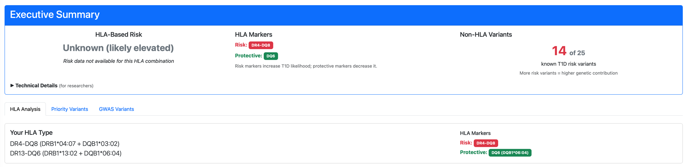
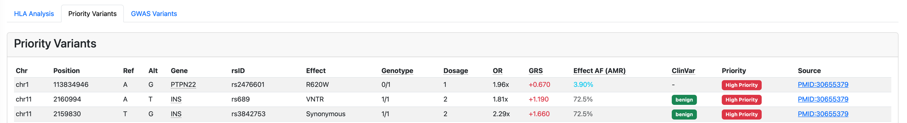
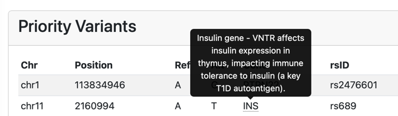
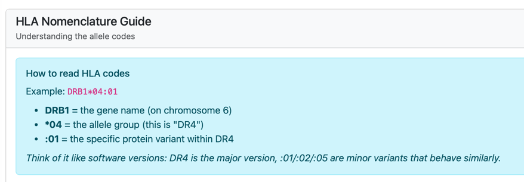

# ⚡ TL;DR
DRAGEN 4.4 gave me a more accurate HLA call, and my new [Type 1 Diabetes Genomics Report](/demos/t1d-report.html) makes it super easy to understand my HLA / Variants Risk.

# 🎯 The Goal

As someone with Type 1 Diabetes who also works in the genomics industry, I have a deep fascination with the genetic component of my Type 1 Diabetes.

I am lucky enough to have had my own genome sequenced and have had a first pass at trying to interpret my own genome.

In summary, my initial analysis focused on just the HLA component of my genome, a region relevant to auto-immunity.

But my initial analysis left me stumped. I had a very unusual set of HLA genes that made even less sense considering I had Type 1 Diabetes.

And what about other important variants related to type 1 diabetes, not just HLA?

Unlike diseases like sickle cell disease, which are a single letter change among 3 billion nucleotides, diseases like Type 1 Diabetes are surprisingly more complex.

I knew as the technology and research got better, there would be more I could learn from my own genome.

For that reason, I have been looking forward to re-analyzing my own genome, and making it easier to understand my own results.

This post will go over my attempt at re-analysis, the open source repository I published to generate the type 1 diabetes genomics report, and what I think could be next.

**[View the Demo Report](/demos/t1d-report.html)** | **[GitHub Repository](https://github.com/dddiaz/type-1-diabetes-genome-analysis)**

> Note: This is a follow-up to my [2023 post](/post/hla/) where I first explored my genome looking for T1D variants. This time I looked at more than just HLA, and built something that produces a comprehensive report.

---

# 🆕 What's New in DRAGEN 4.4

When I first analyzed my genome a few years ago, I used an older version of DRAGEN. DRAGEN 4.4 brought some significant improvements, and I also enabled more features on this re-analysis:

> Note: I help work on Dragen, so I am extremely biased on how awesome it is :)

1. **Better Variant Calling** - Continued improvements to the variant caller
2. **Nirvana** - This re-analysis enabled Nirvana, which adds "translational research-grade annotation of genomic variants"

---

# 🔬 What the Tool Analyzes

## HLA Risk Assessment

- Parses DRAGEN's HLA typing output
- Identifies high-risk haplotypes (DR3-DQ2, DR4-DQ8)
- Identifies protective alleles (DQ6, DR15)
- Calculates odds ratios based on published research (Erlich et al. 2008)
- Examines HLA Typing Confidence by parsing DRAGEN HLA Caller EM algorithm output

Here's what my HLA results look like:



My genotype shows **DR4-DQ8** on one chromosome and **DR13-DQ6** on the other. The DR4-DQ8 is a known high-risk haplotype, but I also carry a protective DQ6 allele.

## Non-HLA GWAS Variants

Beyond HLA, there are 25+ validated SNPs from genome-wide association studies that contribute to T1D risk. These include genes involved in:

- **T cell signaling** (PTPN22, CTLA4)
- **Insulin expression** (INS)
- **Regulatory T cell function** (IL2RA)
- **Viral RNA sensing** (IFIH1)
- **Cytokine signaling** (SH2B3, TYK2)

The tool checks each of these variants in my VCF. My first analysis did not look at these variants at all. So this is a big upgrade.



---

# 📊 My Results

## Highlights

- **14 of 25** known GWAS risk variants present
- **HLA Risk Category: Unknown** (my specific DR4 subtype *04:07 lacks published data!)
- Updated HLA Call

## Notable Findings

### HLA Missing Piece

In my original [2023 HLA post](/post/hla/), I had DQ8 but I appeared to be missing the DR4 gene that usually pairs with it.

  | Gene | Old Analysis | New Analysis |
  |------|--------------|--------------|
  | DRB1 | DR13 + DR13  | DR4* + DR13  |
  | DQB1 | DQ8 + DQ6    | DQ8 + DQ6    |

With the new version of DRAGEN, it seems I do have DR4 (Specifically DRB1 *04:07)! 
The Dragen 4.2 EM Algorithm showed uncertainty across multiple DR4 subtypes, but 4.4 resolved this definitively. 
Now with the ambiguity resolved, I can see a more sensible result!

Quick note on the nomenclature, because I always think it's super confusing:
```txt
DRB1 (gene)
 └── DR4 (serological group = all DRB1*04:XX alleles)
      ├── DRB1*04:01
      ├── DRB1*04:02
      ├── DRB1*04:03
      ├── DRB1*04:04
      ├── DRB1*04:07  ← mine
      └── ... many more
 └── DR13 (serological group = all DRB1*13:XX alleles)
      ├── DRB1*13:01
      ├── DRB1*13:02  ← mine
      └── ...
# DRB1 is the gene, DR4 or DR13 represent the serological group, and the number represents the allele.
```

#### But not so fast!

While having DR4-DQ8 usually means higher risk, my specific DR4 (DRB1*04:07) subtype isn't in the literature. 

So that is why the report says my HLA Risk is Unknown!

The risk is likely elevated, but the literature doesn't have precise numbers.

#### The Takeaway

> The Dragen HLA Caller is getting even better, but the research still needs to catch up on explaining what my specific subtype even means.

### PTPN22 (rs2476601)
I'm heterozygous for the R620W variant. This is one of the strongest non-HLA risk factors for T1D. The risk allele is relatively rare (~4% in Latino/Admixed American populations), but I carry one copy.

**What it does:** PTPN22 regulates T cell receptor signaling. The risk variant causes a gain-of-function, reducing the activation threshold for T cells - potentially making it easier for autoreactive T cells to attack beta cells.

### INS (rs689 and rs3842753)
I'm **homozygous** for both INS risk variants.

**What it does:** The INS gene variants affect insulin expression in the thymus, which is where immune cells learn what's "self" vs "foreign." Lower thymic insulin expression may reduce immune tolerance to insulin - a key autoantigen in T1D.

### Protective DQ6
On the positive side, I carry DQB1*06:04 (DQ6), which is associated with protection against T1D. It is interesting to have both protective HLA genes and HLA genes that confer risk.

---

# 📖 Open Source Type 1 Diabetes Genomics Report

The report includes several features to make the data easy to understand (for myself, and anyone else who ever runs the report):

## Gene Function Tooltips

Hover over any gene name to see what it does:



## HLA Nomenclature Guide

HLA naming can be confusing. The report includes an expandable guide:



---

# 🛠️ Technical Details

## The Stack

- **DRAGEN 4.4** on an FPGA enabled instance for variant calling and HLA typing
- **Nirvana** for variant annotations (gnomAD, ClinVar)
- **Python** for analysis (cyvcf2, pandas)
- **Jinja2** for HTML report generation

---

# ⚠️ Limitations & Disclaimer

**This is for research and educational purposes only.**

- Genetic risk is just one piece of the puzzle for Type 1 Diabetes
- The odds ratios are primarily from European-ancestry populations

This report does not constitute medical advice. If you're concerned about T1D risk, talk to a healthcare professional or genetic counselor.

---

# 🚀 What's Next

Some ideas for the future:
- Pull in more variants for analysis
- Future versions of DRAGEN variant calling will probably get even better, rerun when it is useful.

---

# 💻 Try It Yourself

If you have had your own genome sequenced, and have your own DRAGEN output, feel free to clone the repo:
(Though I would imagine that people who fall into that bucket AND have type 1 diabetes is a small population, you never know I guess.)

```bash
git clone https://github.com/dddiaz/type-1-diabetes-genome-analysis.git
cd type-1-diabetes-genome-analysis

# Install dependencies
uv venv && source .venv/bin/activate
uv pip install -r requirements.txt

# Run analysis
python scripts/run_analysis.py --dragen-dir /path/to/your/dragen/output
```

Or just check out the **[Demo Report](/demos/t1d-report.html)** to see what the output looks like.

---

# 📚 References

- Sharp SA, et al. (2019) Development and Standardization of an Improved Type 1 Diabetes Genetic Risk Score. *Diabetes Care* 42:200-207. [PMID:30655379](https://pubmed.ncbi.nlm.nih.gov/30655379/)
- Erlich H, et al. (2008) HLA DR-DQ Haplotypes and Genotypes and Type 1 Diabetes Risk. *Diabetes* 57(4):1084-1092. [PMID:18252895](https://pubmed.ncbi.nlm.nih.gov/18252895/)
- Robertson CC, et al. (2021) Fine-mapping, trans-ancestral and genomic analyses identify causal variants, cells, genes and drug targets for type 1 diabetes. *Nature Genetics* 53:962-971. [PMID:34127860](https://pubmed.ncbi.nlm.nih.gov/34127860/)

# 🤖 Use of AI
This post was written by a human, and edited with AI.
The Type 1 Diabetes Genomics Analysis Report was developed with the help of Claude Opus 4.5.